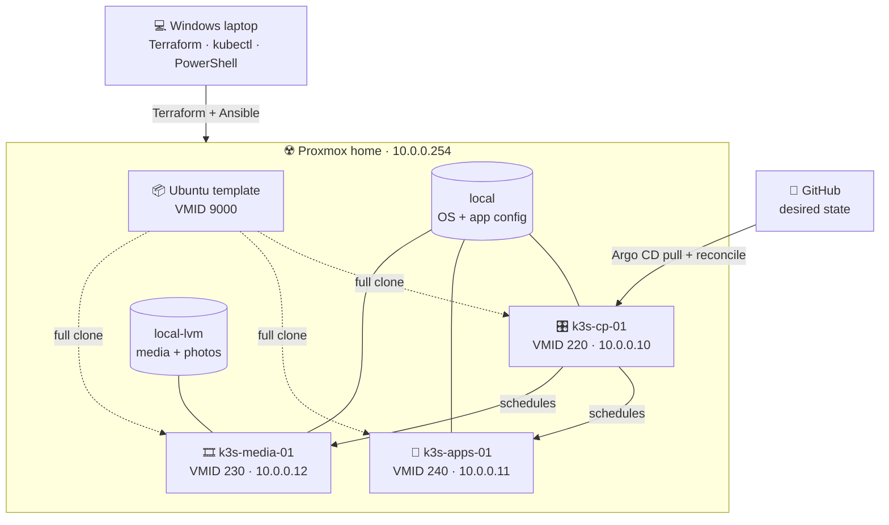
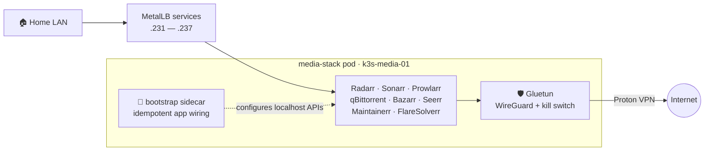
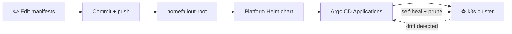

# ☢️ HomeFalloutServer

[](https://www.proxmox.com/)
[](provisioning/terraform)
[](provisioning/ansible)
[](https://k3s.io/)
[](platform)
[](docs/secrets.md)
[](platform/components/jellyfin)
[](platform/components/immich)

> A compact, radioactive little media cloud running on one very determined Proxmox box. ☢️

This repository is the single source of truth for Charles's homelab on `10.0.0.0/24`.
Terraform builds a reusable Ubuntu template and three VMs, Ansible turns them into a k3s cluster,
and Argo CD continuously reconciles the platform and applications from Git.

**New here?** Start with the [documentation hub](docs/README.md) or jump straight to the
[deployment runbook](docs/deployment.md).

## The lab at a glance

| Layer | What runs it | Job |
| --- | --- | --- |
| Hypervisor | Proxmox VE on `10.0.0.254` | Hosts the template, VMs, and virtual disks |
| Provisioning | Terraform | Declares VMID `9000` and three full-clone VMs |
| Configuration | Ansible through Ubuntu 24.04 WSL | Prepares Ubuntu, storage, QEMU agents, and k3s |
| Orchestration | k3s | Schedules one control plane and two workload workers |
| Networking | MetalLB in L2 mode | Gives LAN-friendly addresses to services |
| GitOps | Argo CD | Self-heals the cluster from this repository |
| Secrets | Bitnami Sealed Secrets | Keeps only encrypted application secrets in Git |
| Remote access | Tailscale subnet router (staged) | Optional private access without router ports |
| Workloads | Jellyfin, Immich, Homarr, and the VPN media stack | Streams, stores, requests, and automates media |



## Cluster topology

The cluster intentionally spreads roles across three VMs while respecting the host's 16 GB RAM
budget. All 28 logical CPUs are presented across the VMs because the workloads are bursty; memory
is kept tighter.

| Node | VMID | Address | Role / pool | vCPU | RAM | Disk | Placement |
| --- | ---: | --- | --- | ---: | ---: | --- | --- |
| `k3s-cp-01` | 220 | `10.0.0.10` | server / `control` | 4 | 2 GB | 20 GB `local` | Kubernetes control plane and etcd |
| `k3s-apps-01` | 240 | `10.0.0.11` | agent / `apps` | 8 | 3 GB | 20 GB `local` | Homarr and future general apps |
| `k3s-media-01` | 230 | `10.0.0.12` | agent / `media` | 16 | 7 GB | 28 GB `local` + 600 GB `local-lvm` | Media stack, Jellyfin, and Immich |

The control plane is tainted `NoSchedule`, keeping application pods on the two workers. These VMs
provide scheduling separation, **not high availability**: the server and its single NVMe remain one
physical failure domain.

## Service deck

Everything below is reachable from the home LAN. There is currently no ingress controller, public
exposure, or TLS termination.

| Address | Service | Purpose | Egress |
| --- | --- | --- | --- |
| [`10.0.0.200`](http://10.0.0.200) | Argo CD | GitOps UI and API | Direct LAN |
| [`10.0.0.220`](http://10.0.0.220) | Homarr | Dashboard and integrations | Direct LAN |
| [`10.0.0.230:8096`](http://10.0.0.230:8096) | Jellyfin | Media streaming | Direct LAN |
| [`10.0.0.231`](http://10.0.0.231) | Radarr | Movie automation | Gluetun VPN |
| [`10.0.0.232`](http://10.0.0.232) | Sonarr | TV automation | Gluetun VPN |
| [`10.0.0.233`](http://10.0.0.233) | Prowlarr | Indexer management | Gluetun VPN |
| [`10.0.0.234`](http://10.0.0.234) | qBittorrent | Download client | Gluetun VPN + kill switch |
| [`10.0.0.235`](http://10.0.0.235) | Bazarr | Subtitle automation | Gluetun VPN |
| [`10.0.0.236`](http://10.0.0.236) | Seerr | Requests and discovery | Gluetun VPN |
| [`10.0.0.237`](http://10.0.0.237) | Maintainerr | Library maintenance | Gluetun VPN |
| [`10.0.0.240`](http://10.0.0.240) | Immich | Photo and video backup | Direct LAN |

FlareSolverr is deliberately cluster-internal at `flaresolverr.media.svc.cluster.local:8191`.

## One pod, one VPN boundary

The media applications share a single pod network namespace with Gluetun. Gluetun starts first as
a native sidecar, establishes Proton VPN, applies its firewall, and only then allows the rest of the
pod to start. Homarr, Jellyfin, and Immich remain separate because their LAN traffic should not take
the scenic route through Canada.



## GitOps lifecycle



Each entry in `platform/values/values-prod.yaml` can produce up to three ordered Argo CD
Applications:

```text
platform/components/<name>/
├── pre-resources/   # optional prerequisites       tier - 1
├── values/          # optional upstream chart      tier
└── resources/       # manifests owned by this repo tier + 1
```

That small contract keeps every component self-contained and makes sync order predictable without
sprinkling arbitrary wave numbers through every manifest.

## Quick deployment

From a normal PowerShell prompt on the Windows laptop:

```powershell
.\scripts\prepare-workstation.ps1
.\scripts\deploy.ps1
.\scripts\k.ps1 get nodes -o wide
.\scripts\k.ps1 get pods -A
```

The first command prepares local tools and gitignored credentials. The second builds the template
and VMs, runs Ansible, bootstraps Argo CD, seals application secrets, and starts reconciliation.
Read the [deployment runbook](docs/deployment.md) before a first apply; it includes the Proxmox and
router prerequisites as well as verification and safe rerun instructions.

## Documentation

| Guide | Open this when... |
| --- | --- |
| [Documentation hub](docs/README.md) | You want the map of all available guides |
| [Architecture](docs/architecture.md) | You want to understand ownership, placement, dependencies, and failure domains |
| [Component catalog](docs/components.md) | You want to know what every platform and application component does |
| [Networking](docs/networking.md) | You need the IP plan, packet paths, VPN boundary, or router requirements |
| [Deployment](docs/deployment.md) | You are building or rebuilding the lab from the Windows laptop |
| [Operations](docs/operations.md) | You are checking health, updating apps, backing up, or troubleshooting |
| [Storage](docs/storage.md) | You need PVC, disk, capacity, Longhorn, or upgrade details |
| [Secrets](docs/secrets.md) | You are sealing, rotating, auditing, or recovering credentials |
| [Application wiring](docs/configuration.md) | You are finishing Homarr/Jellyfin setup or checking the bootstrap sidecar |
| [Tailscale](docs/tailscale.md) | You want to enable private remote access and optional exit-node routing |
| [Proxmox prerequisites](docs/proxmox-prerequisites.md) | You need the API role, storage flags, or address reservations |

## Repository map

```text
HomeFalloutServer/
├── bootstrap/                 # the one Argo CD root Application
├── docs/                      # architecture and operator runbooks
├── platform/                  # app-of-apps Helm chart
│   ├── components/            # one folder per platform/workload component
│   ├── templates/             # generic Argo CD Application + Project templates
│   ├── values/                # production component catalog and sync tiers
│   └── secrets/               # plaintext inputs, always gitignored
├── provisioning/
│   ├── terraform/             # Proxmox template, VMs, disks, and inventory output
│   └── ansible/               # Ubuntu preparation, k3s, and kubeconfig retrieval
└── scripts/                   # Windows prepare, deploy, bootstrap, sealing, and kubectl helpers
```

---

Built for a single server, documented like it might save future-us at 2 a.m. ☢️
