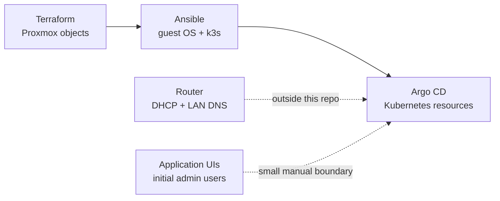
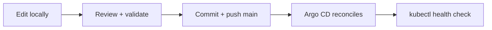

# Homelab documentation

Welcome to the operator's manual for HomeFalloutServer. The root [README](../README.md) is the
tour; this folder explains how the machinery fits together, how to deploy it, and how to recover
it when the gremlins arrive.

## Choose your route

| I want to... | Read |
| --- | --- |
| Understand the whole system | [Architecture](architecture.md) |
| Look up a platform or application | [Component catalog](components.md) |
| Understand addresses, MetalLB, DNS, or the VPN | [Networking](networking.md) |
| Deploy or rebuild from the Windows laptop | [Deployment runbook](deployment.md) |
| Check health, update, back up, or troubleshoot | [Operations runbook](operations.md) |
| Understand disks, PVCs, capacity, or Longhorn | [Storage](storage.md) |
| Create, rotate, audit, or recover secrets | [Secret management](secrets.md) |
| Finish the app integrations | [First-run application wiring](configuration.md) |
| Enable private remote access | [Tailscale subnet router](tailscale.md) |
| Use hostnames instead of IPs, or block ads | [DNS and ingress](dns-and-ingress.md) |
| Watch Jellyfin on the TV wired to the host | [TV console](tv-console.md) |
| Drive the TV, lights, and Jellyfin from a phone | [Household remote](remote.md) |
| Prepare a fresh Proxmox host | [Proxmox prerequisites](proxmox-prerequisites.md) |

## System card

| Item | Current value |
| --- | --- |
| Proxmox host | `home` at `10.0.0.254` |
| LAN / gateway | `10.0.0.0/24` / `10.0.0.1` |
| Hardware | Intel i7-14700, 16 GB DDR4, 1 TB NVMe |
| Kubernetes | k3s, one server and two agents |
| Node addresses | `10.0.0.10`, `.11`, `.12` |
| LoadBalancer ranges | `10.0.0.200-229`, `10.0.0.230-250` |
| Argo CD UI | `http://10.0.0.200` on the LAN |
| Ingress / LAN DNS | Traefik `10.0.0.201`, AdGuard Home `10.0.0.202` |
| Service hostnames | `*.home.lan` via AdGuard rewrite to Traefik |
| Pod / service CIDRs | `10.42.0.0/16`, `10.43.0.0/16` |
| GitOps root | `homefallout-root` in `argocd` |
| Persistent config | Node-local PVCs on Proxmox `local` |
| Bulk data | 600 GB disk on `local-lvm`, mounted at `/mnt/data` |
| Remote access model | LAN plus an authenticated Tailscale subnet router |

## Source-of-truth boundaries

- Terraform owns the Ubuntu template, VM hardware, cloud-init, and the attached bulk disk.
- Ansible owns packages, QEMU guest-agent service, `/mnt/data`, k3s installation, node metadata,
  and the laptop kubeconfig.
- Argo CD owns everything under `platform/` after bootstrap.
- The router still owns DHCP exclusions and optional friendly DNS records.
- Initial Homarr and Immich admin setup is intentionally manual; the media bootstrap handles a
  blank Jellyfin installation and automates the machine-to-machine wiring.

If a value is not in its owning layer, fix the source of truth rather than patching the live object.

## Safety rails

- Never commit `terraform.tfvars`, `platform/secrets/*.yaml`, the Argo CD deploy key, kubeconfig, or
  the Sealed Secrets controller-key backup.
- Do not expose these LAN services directly to the internet. Add authenticated ingress and TLS
  before any remote-access project.
- `Retain` prevents Kubernetes from automatically deleting a volume; it does not make a backup.
- Three VMs on one server are one hardware failure domain. Back up outside the Proxmox host.
- Confirm Gluetun and qBittorrent report the same VPN address before adding downloads.

## Normal change workflow

Kubernetes changes should normally flow through Git. Direct `kubectl` changes are useful for
diagnostics, but Argo CD will replace any drift with the committed state.
