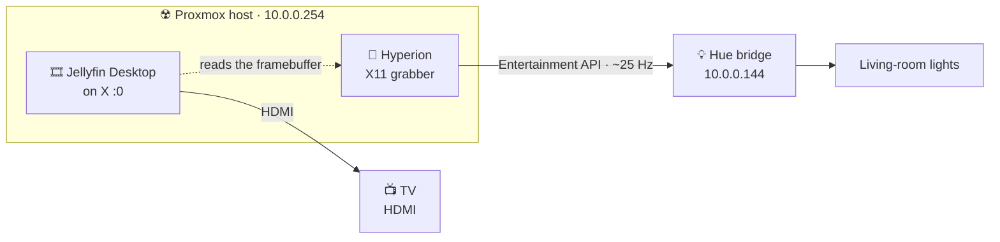

# Ambient lighting

Driving the Hue lights from whatever the TV is showing — the effect Philips sells as Hue Sync.
Normally it needs hardware in the HDMI path. Here it does not, because of an accident of how this
house watches television.

## Why this is possible at all

Ambient lighting needs something that can *see* the picture, and on an ordinary setup nothing can.
The usual answers are a **Hue Play HDMI Sync Box** sitting in the cable run, or Philips' own **Hue
Sync app** on the TV, which needs a 2022-or-newer Samsung. The living-room set is a 2020
`QN55Q80TAFXZC`, so the app route is closed and the box costs about $250.

But this TV does not receive a picture so much as get handed one: the frames are rendered by the
Jellyfin kiosk on the Proxmox host ([TV console](tv-console.md)) and pushed out over HDMI. Software
on that host can read its own framebuffer. There is no HDMI problem to solve because the picture
starts on a machine we already control.



The same fact sets the boundary. Hyperion sees **only what the kiosk draws**. Tizen apps, live TV,
a games console on another HDMI port — all invisible. If you want those lit too, the Sync Box is the
only thing that covers them, and it is the honest answer to that requirement.

## The test that decides everything

**Do this before installing anything.** Hardware-decoded video is sometimes drawn through a GPU
overlay plane that never reaches the framebuffer a screen grabber can read. When that happens the
failure is silent and confusing: Hyperion installs, runs, logs no errors, and drives every light to
black.

Play something on the TV, then capture the screen:

```powershell
ssh root@10.0.0.254 'XAUTH=$(ls -t /tmp/serverauth.* | head -1); DISPLAY=:0 XAUTHORITY=$XAUTH scrot -o /tmp/tv.png; ls -lh /tmp/tv.png'
scp root@10.0.0.254:/tmp/tv.png .
```

Open it. **The video frame must be in the picture.** A black rectangle where the video should be
means X11 capture is blind to this player, and no amount of Hyperion configuration will fix it.

File size is a useful tell on its own: a real frame runs to hundreds of KB, while an all-black one
compresses to almost nothing. `tv-hyperion.sh --test` applies that heuristic and refuses to pretend
a tiny capture is a success.

**Verified on this host, 2026-08-20.** With Jellyfin Desktop paused on a film, the capture came back
at 1.27 MB and the frame was there in full colour - against 181 KB for the same screen showing only
the library UI. VA-API decoding on this iGPU composites into the framebuffer rather than an overlay
plane, so X11 capture sees the picture. This is the question that decides the whole approach, and
here the answer is yes.

## Prerequisite: an Entertainment area

Hyperion streams to Hue through the **Entertainment API**, which will not start without an
Entertainment area to stream into. That area can only be created in the **official Philips Hue
app** — you place the lights on a small 3D map of the room. Home Assistant cannot create one, and
neither can this script.

Do it first. If Hyperion's entertainment-group dropdown is empty later, this is why.

## Install

`scripts/tv-hyperion.sh` runs on the Proxmox host, like `tv-kiosk.sh` and for the same reason. It is
idempotent.

```powershell
scp scripts\tv-hyperion.sh root@10.0.0.254:/root/
ssh root@10.0.0.254 'bash /root/tv-hyperion.sh --test'
ssh root@10.0.0.254 'bash /root/tv-hyperion.sh --hue'
ssh root@10.0.0.254 'bash /root/tv-hyperion.sh'
```

The version is pinned rather than tracked through the project's apt repo, which still serves
packages but no longer publishes a signing key at any documented URL. An unverified apt source on a
hypervisor is a worse trade than a pinned download.

`--hue` needs the round button on top of the bridge pressed first; it waits 60 seconds for it. It
asks the bridge for a **clientkey** as well as a username, which an ordinary Hue pairing does not
do and which the Entertainment API cannot stream without. Both land in `/root/.hyperion-hue-credentials`,
root-only, because that clientkey controls every light in the house.

| What it changes | Where |
| --- | --- |
| Hyperion `2.2.1` | pinned `.deb` from GitHub releases, installed through `apt` for its dependencies |
| `hyperion-kiosk.service` | Runs as `tv` inside the kiosk's X session |
| Hyperion's settings | `/var/lib/hyperion` |
| Hue credentials | `/root/.hyperion-hue-credentials`, mode 0600 |

The package's postinst enables and starts `hyperion@root.service`, and the script disables it
deliberately. That instance runs as root with no access to the kiosk's X
server, so it can never grab this screen — but it does claim port `8090` and it will fight for the
Hue stream, which leaves the web UI showing the useless instance while the useful one is dead. A
glob does not match a running template instance, so the script enumerates them by name; an earlier
version used `hyperion@*` and both were left running.

`XAUTHORITY` is resolved at service start rather than written into the unit, because `startx` picks a
new `/tmp/serverauth.*` filename every time the session restarts. The unit fails fast when the
session is not up yet and lets `Restart=always` retry, since the kiosk is started by getty autologin
and there is no systemd unit to order against.

## Configure

Everything else happens in Hyperion's web UI on port `8090`. Nothing in the script writes Hyperion's
configuration: its UI is good, and a generated config JSON is a fragile thing to maintain against
upstream schema changes.

1. **Capture** — already enabled by the run on 2026-08-20: **XCB**, 20 fps, 80x45, with blackborder
   detection on. Use **XCB, not X11** — see below. The live preview must show what is on the TV.
2. **LED Hardware → Philips Hue** — bridge address `10.0.0.144`, then the username and clientkey
   from `--hue`, then pick the Entertainment area.
3. **Layout** — set how many virtual LEDs sit along each edge, and which light maps to which. With a
   handful of bulbs, keep it coarse.

### Use XCB, not X11

Hyperion offers five screen grabbers here (`framebuffer`, `x11`, `xcb`, `qt`, `drm`). **The `x11`
one crashes it on this host.** Enabling it produced, within seconds:

```
X Error of failed request:  RenderBadPicture (invalid Picture parameter)
  Major opcode of failed request:  139 (RENDER)
 caught signal: SIGABRT
 caught signal: SIGSEGV
```

and then a restart loop, because `Restart=always` faithfully brings back a process that dies on
startup every time. `xcb` grabs through a different code path and has been stable since.

If this ever recurs, the API is unreachable during the crash loop, so the way out is to stop the
service and edit the setting directly:

```bash
systemctl stop hyperion-kiosk.service
python3 -c "
import sqlite3, json
db = sqlite3.connect('/var/lib/hyperion/db/hyperion.db')
c = db.cursor()
c.execute(\"SELECT config FROM settings WHERE type='framegrabber'\")
cfg = json.loads(c.fetchone()[0]); cfg['device'] = 'xcb'
c.execute(\"UPDATE settings SET config=? WHERE type='framegrabber'\", (json.dumps(cfg),))
db.commit()"
systemctl start hyperion-kiosk.service
```

## What it costs you

**The lights belong to Hyperion while it streams.** Entertainment mode takes exclusive control, so
Home Assistant and the Hue app cannot drive those bulbs until it stops. This is normal, it is not a
bug, and it is the main reason to scope the Entertainment area to the living room rather than the
whole house.

**More unsupported software on the hypervisor**, on top of what the kiosk already added. Measured
here: **45 MB** resident, against roughly 1.3 GB free on this 16 GB host. Cheaper than expected, but
`tv-hyperion.sh` still prints the free figure during preflight because this is the resource the host
is actually short of.

**Around 25 Hz** through the Entertainment API. Smooth, not instantaneous.

## State as of 2026-08-20

Done: Hyperion installed and running as the kiosk user, XCB capture live, the bridge paired with a
clientkey, and the Entertainment area confirmed to exist.

| Thing | Value |
| --- | --- |
| Entertainment area | `Living Room TV`, type `screen`, **one** channel |
| That one light | `Living room wall` — a Hue lightstrip plus |
| v1 group id | `201` |
| v2 configuration id | `82884f31-871e-42f7-bc98-6a1b6f898b47` |

The **LED device** was finished in the web UI under **LED Instances → LED Hardware → Philips Hue**.
Use its wizard: it finds the bridge, accepts the username and clientkey from
`/root/.hyperion-hue-credentials` pasted into *User ID* and *Clientkey*, and offers the Entertainment
area in a dropdown. Setting the device over the JSON API was attempted first and rejected as
`Invalid params` every time - the field names are readable from `config/getschema` under
`properties.alldevices.philipshue`, but the wizard composes them correctly and takes a minute.

**Then change `host` from the mDNS name to `10.0.0.144`.** The wizard writes the discovered name,
`Hue Bridge - AF839F._hue._tcp.local`, which puts mDNS resolution from the kiosk user's context into
the path of every frame for no benefit. The IP is in *Specific Settings*, or set it over the API by
reading the device object back, changing one field, and writing it again - which works, because by
then the object came from the wizard and validates.

Confirmed streaming from the bridge's own side:

```
Living Room TV    status=active   active_streamer=True
```

Note `useAPIv2` defaults to **true**, and in that mode `groupId` is the **v2 UUID above**, not `201`.

**One light limits the effect.** A single channel means one average colour for the whole screen — no
left/right separation. Adding more bulbs to the `Living Room TV` area in the Hue app is what makes
this look impressive rather than merely present.

### Change the Hyperion password

It is `hyperion` by default, the web UI is reachable from the whole LAN, and that login is enough to
reconfigure the lights. Change it in the UI under Configuration → Network Services.

## Troubleshooting

| Symptom | Likely cause |
| --- | --- |
| Every light goes black during playback | The grabber cannot see the video; rerun `--test` while something plays |
| Entertainment dropdown is empty | No Entertainment area exists; create one in the Hue app |
| Lights unresponsive in Home Assistant | Expected while Hyperion streams; stop the service to hand them back |
| Service restarts every 10 seconds | The kiosk session is down; `systemctl restart getty@tty1.service` |
| Colours lag badly | Layout too fine for the bulb count, or the host is under load |
| Nothing on port 8090 | `systemctl status hyperion-kiosk.service`, then its journal |

## Undoing it

```bash
bash /root/tv-hyperion.sh --uninstall
```

Removes the service and purges Hyperion, leaving the kiosk completely untouched. Hyperion's settings
and the Hue credentials are left behind on purpose so a reinstall is cheap; delete the Hue user in
the Hue app if you are finished with it.
