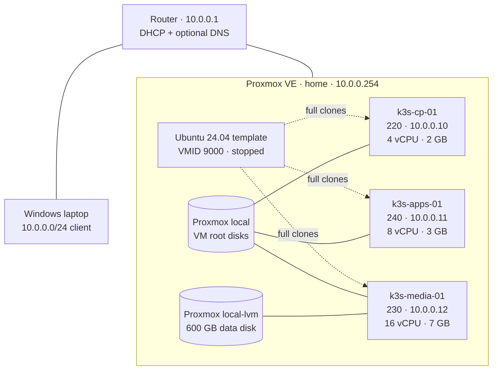
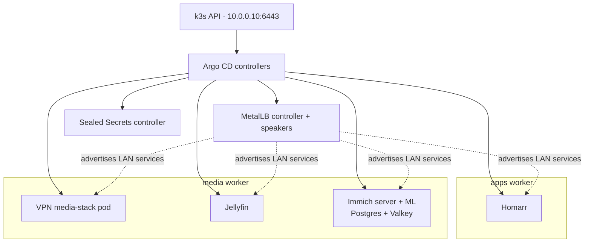
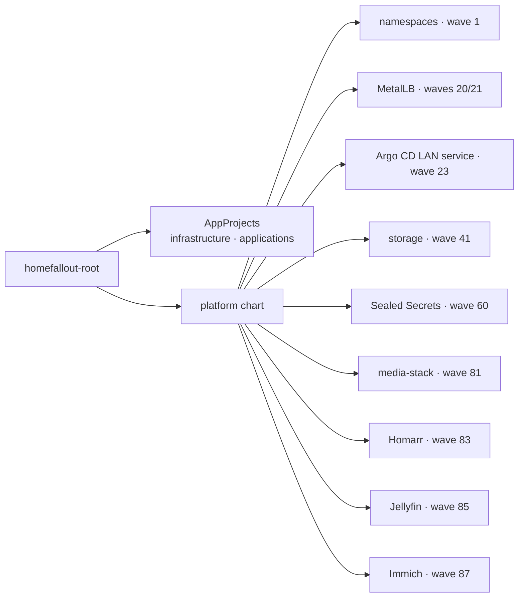
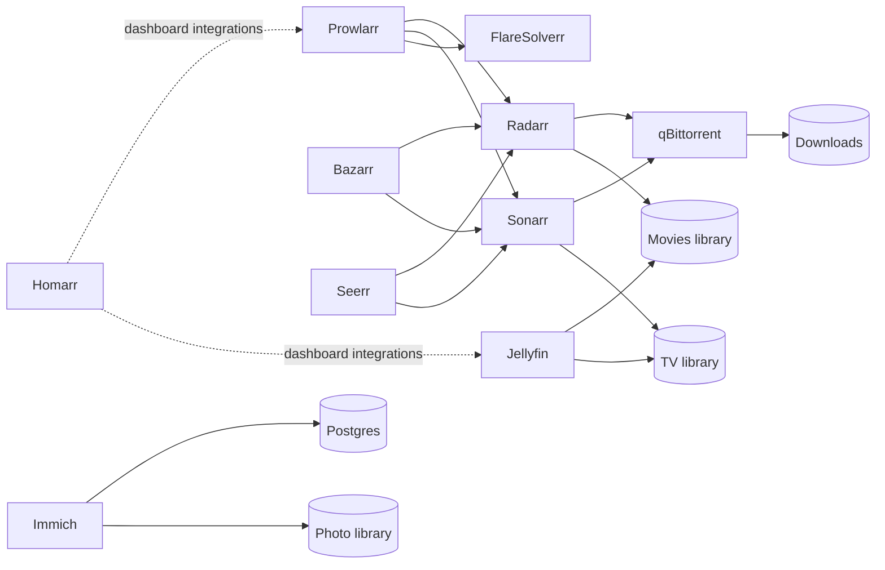

# Architecture

HomeFalloutServer borrows the reference homelab's layered ownership and component model, trimmed
to fit one physical server with 16 GB of RAM. It favors repeatability, understandable failure
modes, and low operational overhead over pretend high availability.

## Design principles

1. **Declare infrastructure.** The Proxmox template, VM hardware, and disks live in Terraform.
2. **Configure guests once, idempotently.** Ansible prepares Ubuntu and installs k3s.
3. **Let Git win.** Argo CD is the owner of Kubernetes resources and repairs live drift.
4. **Keep state deliberate.** Config/database PVCs and bulk libraries have different storage and
   backup policies.
5. **Make the VPN boundary structural.** The media applications share Gluetun's pod network
   namespace; playback and photo traffic do not.
6. **Spend resources where they matter.** One control plane and two workers are appropriate here;
   extra control planes would consume RAM without surviving loss of the physical host.

## Layers and ownership

| Layer | Owner | Inputs | Outputs |
| --- | --- | --- | --- |
| Physical | Proxmox administrator | CPU, RAM, NVMe, bridge, storage definitions | `home`, `local`, `local-lvm`, `vmbr0` |
| Virtual | Terraform | `terraform.tfvars`, Ubuntu cloud image | template `9000`, VMs `220/240/230`, Ansible inventory |
| Guest OS | Ansible | generated inventory and SSH key | packages, QEMU agent, mounted data disk, k3s services |
| Cluster bootstrap | PowerShell scripts | kubeconfig and repository credential | Argo CD, root Application, initial sealed resources |
| Platform | Argo CD | `platform/` Helm chart | namespaces, MetalLB, storage classes/PVs, Sealed Secrets |
| Applications | Argo CD | component `resources/` | workloads, services, PVCs, encrypted secrets |
| LAN | Router administrator | address plan | DHCP exclusions and optional DNS records |

## Physical and virtual topology

| VM | Kubernetes role | Node label | Taint | Scheduled workloads |
| --- | --- | --- | --- | --- |
| `k3s-cp-01` | server | `homelab.charles/pool=control` | `control-plane=true:NoSchedule` | k3s API, scheduler, controllers, etcd, cluster system pods |
| `k3s-apps-01` | agent | `homelab.charles/pool=apps` | none | Homarr |
| `k3s-media-01` | agent | `homelab.charles/pool=media` | none | media-stack, Jellyfin, Immich, databases, data-bound pods |

All 28 logical CPUs are presented to VMs, which is acceptable CPU overcommit for bursty home
workloads. VM memory totals 12 GB, leaving roughly 3 GB for Proxmox after normal host use. The media
worker carries the largest allocation because Immich machine learning and Jellyfin transcoding are
the heaviest workloads.

## Kubernetes control and data planes

k3s uses its default pod CIDR `10.42.0.0/16` and service CIDR `10.43.0.0/16`. The bundled Traefik
and ServiceLB components are disabled. MetalLB supplies L2 LoadBalancer addresses directly on the
home LAN instead.

## GitOps application model

`bootstrap/root-app.yaml` creates `homefallout-root`. That Application renders the local platform
chart, which creates two AppProjects and one or more child Applications for each enabled component.

Each component in `platform/values/values-prod.yaml` can generate these phases:

| Phase | Component source | Relative wave | Use |
| --- | --- | ---: | --- |
| Prerequisite | `pre-resources/` | tier - 1 | CRDs or objects required before a chart |
| Upstream chart | `chart` plus `values/chart-prod.yaml` | tier | Third-party controllers |
| Owned resources | `resources/` | tier + 1 | Local manifests and encrypted secrets |

Argo CD automated sync has pruning and self-healing enabled. Removing a declared resource removes
it from the cluster; manually editing a managed object is temporary. `CreateNamespace=true` is a
convenience, while the namespaces component remains the explicit source of namespace definitions.

## Application dependency graph

The media `bootstrap` sidecar discovers application API keys from their persistent config files
and idempotently asserts the machine-to-machine connections. Interactive identity setup remains in
the application UIs. See [First-run application wiring](configuration.md).

## VPN boundary and startup ordering

The `media-stack` Deployment uses `strategy: Recreate` and contains a restartable Gluetun init
container. Kubernetes starts Gluetun, waits for its startup probe to pass, then launches the other
containers. Because containers in one pod share a network namespace, Gluetun owns the pod's default
route and firewall. Its allowed private ranges preserve LAN, pod, and service connectivity.

The pod includes Radarr, Sonarr, Prowlarr, qBittorrent, FlareSolverr, Bazarr, Seerr, Maintainerr,
and the bootstrap helper. A config change to any of those containers recreates the complete pod.
This is a deliberate trade: a strong, inspectable VPN boundary in exchange for a larger restart
unit.

Homarr, Jellyfin, and Immich use separate pods and direct egress. Streaming or photo transfers
should never depend on the VPN tunnel.

## State and failure domains

| Failure | Impact | What survives | Recovery source |
| --- | --- | --- | --- |
| Application container restart | Brief app outage | All PVC and bulk data | Kubernetes restarts it |
| Worker VM reboot | Apps on that worker stop | VM disks and retained PVC data | k3s + Argo CD reschedule locally |
| Media worker loss | Media, Jellyfin, Immich unavailable | Only if its virtual disks survive | VM/data-disk recovery and backups |
| Control-plane VM loss | Kubernetes API and reconciliation stop | Existing worker processes may continue temporarily | Rebuild control plane and restore state |
| Proxmox/NVMe loss | Entire lab unavailable | Nothing on-host is independent | External backups and IaC repository |

Three VMs improve organization, resource control, and maintenance. They do not protect against the
loss of `home`, its power supply, or its NVMe. This is why Longhorn replicas are not useful yet and
why the sealing key, databases, config volumes, and irreplaceable photos need off-host backups.

## Deliberate omissions

- **No Longhorn:** there are no independent storage nodes; see [Storage](storage.md).
- **No shared ingress or certificate automation:** stable MetalLB addresses are simpler for a
  LAN-only lab; most application UIs remain plain HTTP.
- **No three-node control plane:** the RAM cost does not buy physical availability on one host.
- **No GPU passthrough yet:** Jellyfin currently transcodes on CPU; Intel iGPU passthrough is a
  future optimization.
- **No on-cluster observability stack:** current RAM is better reserved for Immich and playback.

These are current design decisions, not permanent limitations. Add complexity when the hardware
and operational need justify it.

## Remote-access path

The Tailscale subnet-router component advertises the LAN, pod CIDR, and service CIDR to
authenticated tailnet devices. It does not advertise an exit node. This adds private remote
reachability without public router ports. Its state is persistent and its auth key is delivered by
a SealedSecret. Route approval and verification are documented in the
[Tailscale runbook](tailscale.md).
