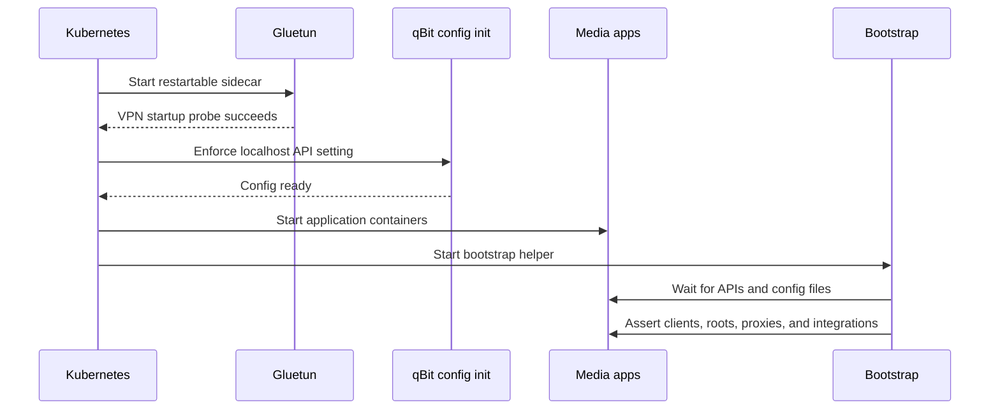

# Component catalog

This catalog covers every component declared by the production platform chart and the important
containers within each application. The definitive configuration remains under
`platform/components/`.

## Platform components

| Component | Namespace | Source | Wave | Responsibility |
| --- | --- | --- | ---: | --- |
| `namespaces` | `argocd` | Local resources | 1 | Creates `networking`, `media`, `photos`, and `secrets` |
| `metallb` | `networking` | Helm `0.15.3` + resources | 20/21 | Advertises stable LAN LoadBalancer addresses using L2 |
| `argocd` | `argocd` | Local resources | 23 | Adds a stable `10.0.0.200` LAN Service without patching upstream manifests |
| `traefik` | `networking` | Helm `41.2.0` | 26 | Ingress controller for every `*.home.lan` hostname |
| `adguard` | `networking` | Local resources | 29 | LAN DNS filtering, and resolves `*.home.lan` to Traefik |
| `storage` | `media` | Local resources | 41 | Defines local storage classes, PVs, and bulk-data PVCs |
| `sealed-secrets` | `secrets` | Helm `2.19.1` | 60 | Decrypts committed SealedSecrets into namespace Secrets |
| `media-stack` | `media` | Local resources | 81 | Runs the VPN-sharing automation pod and its services |
| `homarr` | `media` | Local resources | 83 | Runs the dashboard independently on the apps worker |
| `jellyfin` | `media` | Local resources | 85 | Streams the media library directly over the LAN |
| `immich` | `photos` | Local resources | 87 | Runs photo storage, API, database, cache, and ML |
| `komga` | `media` | Local resources | 89 | Serves the comic library directly over the LAN |
| `ingress` | `media` | Local resources | 91 | Hostname rules for every LAN service, across four namespaces |

The `tailscale` resources-only component runs at wave 25 as a subnet router in `networking`; see
[Tailscale remote access](tailscale.md).

The `infrastructure` AppProject can target all namespaces and cluster resources. The
`applications` AppProject is restricted to `media` and `photos`, with Namespace as its only
cluster-scoped allow-list entry.

## Media stack

The `media-stack` Deployment is pinned to `homelab.charles/pool=media`, uses `Recreate`, and shares
one pod network namespace. Its configuration PVCs use `config-local-retain`; its shared data volume
uses `media-local`.

| Container | Image policy | Port | Persistent state | Role |
| --- | --- | ---: | --- | --- |
| Gluetun | Pinned `v3.41.1` | internal control ports | None | Proton WireGuard tunnel, firewall, kill switch, NAT-PMP port forwarding |
| qBittorrent config init | Pinned BusyBox `1.37` | — | qBittorrent config PVC | Enables localhost API bypass while preserving LAN WebUI authentication |
| Mylar config init | Python `3.13-slim` | — | Mylar config PVC | Asserts Mylar's Git-owned `config.ini` (its settings have no API) before start |
| Radarr | Pinned LinuxServer release | `7878` | 512 Mi config + shared `/data` | Movie library automation |
| Sonarr | Pinned LinuxServer release | `8989` | 512 Mi config + shared `/data` | TV library automation |
| Prowlarr | Pinned LinuxServer release | `9696` | 512 Mi config | Indexer management and Arr synchronization |
| qBittorrent | Pinned LinuxServer release | `8080` | 512 Mi config + shared `/data` | VPN-bound downloads |
| FlareSolverr | Pinned `v3.5.0` | `8191` | None | Internal anti-bot proxy for compatible indexers |
| Bazarr | `latest` | `6767` | 512 Mi config + shared `/data` | Subtitle automation |
| Mylar | Pinned LinuxServer release | `8090` | 512 Mi config + shared `/data` | Comic library automation: search, weekly pull-list, DDL, import |
| Seerr | `latest` | `5055` | 512 Mi config | Media requests and discovery |
| Bootstrap | Python `3.13-slim` | — | Read-only app configs + shared `/data` | Idempotently wires local APIs and optionally provisions Homarr |
| Maintainerr | `latest` | `6246` | 512 Mi config | Library retention and maintenance rules |

The workload starts in this order:

### Automated wiring

The bootstrap helper continuously and idempotently configures:

- qBittorrent categories, download paths, LAN credentials, and Proton's forwarded listen port.
- qBittorrent as the Radarr and Sonarr download client.
- `/data/library/movies` and `/data/library/tv` as Arr root folders.
- Radarr and Sonarr as Prowlarr applications.
- FlareSolverr as Prowlarr's proxy.
- EZTV, LimeTorrents, Nyaa.si, and YTS as credential-free Prowlarr indexers.
- Matching optional `Ultra-HD` quality profiles in Radarr and Sonarr.
- Bazarr's credential-free English/French providers, language profile, search policy, and
  Radarr/Sonarr/Jellyfin connections.
- Jellyfin library-update notifications in Radarr and Sonarr.
- Jellyfin Movies and TV Shows libraries backed by the shared read-only media mount.
- Seerr's Jellyfin admin, enabled libraries, and default Radarr/Sonarr instances.
- Maintainerr's Jellyfin, Radarr, Sonarr, Seerr, and qBittorrent connections.
- Maintainerr's storage-aware cleanup rules and their review windows.
- Mylar as a Prowlarr application, so comic-capable (`7030`) indexers sync automatically.
- The `comics` qBittorrent category with its own completed subfolder for Mylar's folder monitor.
- Komga's first-run admin (from `apps-admin`) and its `Comics` library with ComicInfo and
  Mylar `series.json` metadata import enabled.
- Homarr tiles, integrations, board, and widgets once its API key exists.

Jellyfin first-run setup and its shared administrator are bootstrap-managed from the sealed
`apps-admin` credentials. Homarr still needs its initial admin account and API key because its API
cannot create the account that owns the key. Once that value exists, the dashboard, Seerr, and
Maintainerr are configured without browser wizards. External
Additional private Prowlarr indexers still require an explicit provider choice and sealed credentials.
The full procedure is in [First-run application wiring](configuration.md).

## Homarr

Homarr is deliberately its own component, Deployment, Service, PVC, and Argo CD Application.

| Property | Value |
| --- | --- |
| Placement | `k3s-apps-01` via pool label `apps` |
| LAN address | `http://10.0.0.220` |
| Container port | `7575`, exposed as service port `80` |
| Persistent path | `/appdata` on a 1 Gi `config-local-retain` PVC |
| Secret | `homarr-secrets` SealedSecret |
| Resources | request `100m / 256Mi`; limit `1 CPU / 1Gi` |

Keeping Homarr outside the VPN pod gives it an independent lifecycle and keeps dashboard traffic
direct. The media bootstrap talks to it over Kubernetes service DNS.

## Jellyfin

Jellyfin is a standalone Deployment on the media worker.

| Property | Value |
| --- | --- |
| Placement | `k3s-media-01` via pool label `media` |
| LAN address | `http://10.0.0.230:8096` |
| Configuration | 2 Gi retained local PVC mounted at `/config` |
| Cache | 3 Gi retained local PVC mounted at `/cache` |
| Library | Shared media PV mounted read-only at `/media` |
| Resources | request `300m / 768Mi`; limit `4 CPU / 3Gi` |
| Transcoding | CPU by default; Intel iGPU is not passed through, see [TV console](tv-console.md) |

The read-only library mount keeps Jellyfin from modifying the files owned by Radarr and Sonarr.
Its LAN stream never traverses Gluetun.

## Komga

Komga follows the Jellyfin pattern: a standalone Deployment on the media worker that consumes the
library Mylar builds, with reading traffic staying off the VPN.

| Property | Value |
| --- | --- |
| Placement | `k3s-media-01` via pool label `media` |
| LAN address | `http://10.0.0.239:25600` |
| Configuration | 1 Gi retained local PVC mounted at `/config` (its database grows with the library) |
| Library | Shared media PV mounted read-only at `/data` |
| Resources | request `100m / 256Mi`; limit `2 CPU / 1536Mi`, JVM capped at `-Xmx1g` |
| Provisioning | Media bootstrap claims the admin and creates the `Comics` library over service DNS |

Sign in with the `apps-admin` username as an e-mail address (`<username>@homefallout.local`) and
the shared password. The `Comics` library scans hourly and on startup; phone and tablet apps
(Mihon, Panels, Chunky) connect through OPDS at `http://10.0.0.239:25600/opds/v1.2`.

## Immich

Immich runs as four cooperating workloads in `photos`, all pinned to the media worker because its
database PVC and bulk photo PV are node-local.

| Workload | Exposure | State | Resource request / limit | Role |
| --- | --- | --- | --- | --- |
| `immich-server` | LAN `10.0.0.240:80` | Shared photo PV | `200m/512Mi` · `2 CPU/2Gi` | API, web UI, jobs, uploads |
| `immich-postgres` | Cluster `5432` | 8 Gi retained PVC | `200m/512Mi` · `2 CPU/1536Mi` | Authoritative metadata database |
| `immich-valkey` | Cluster `6379` | Disposable | `50m/64Mi` · `500m/512Mi` | Queue/cache data |
| `immich-machine-learning` | Cluster `3003` | 2 Gi model cache PVC | `200m/1Gi` · `3 CPU/3Gi` | Face recognition and smart search |

The `immich-database` SealedSecret supplies the server and Postgres with matching database values.
Photo originals live under `/mnt/data/photos`; the database must be backed up separately because
the files alone do not reconstruct albums, users, or metadata.

## Home Assistant

Home Assistant is the household remote: one web app that drives the Samsung TV, the Hue bridge, and
Jellyfin, with its own non-admin logins for roommates. See [Household remote](remote.md).

| Property | Value |
| --- | --- |
| Placement | `k3s-apps-01` via pool label `apps` |
| LAN address | `http://10.0.0.241:8123`, and `remote.home.lan` through Traefik |
| Networking | `hostNetwork` — SSDP/mDNS discovery and Wake-on-LAN cannot cross the pod network |
| Configuration | 5 Gi retained local PVC mounted at `/config` |
| Seeding | Init container writes `configuration.yaml` once, with the cluster CIDRs as trusted proxies |
| Resources | request `100m / 512Mi`; limit `2 CPU / 2Gi` |

`hostNetwork` is the notable choice and it has a standing consequence: nothing else may bind `8123`
on the apps node. Without it the TV and the Hue bridge are invisible to discovery and the TV cannot
be woken at all.

## Supporting controllers

### MetalLB

MetalLB is installed from its upstream chart, then the component's `resources/` Application creates
two manually assigned address pools and one L2Advertisement. No service receives an address unless
its manifest requests one explicitly.

### Sealed Secrets

The controller watches `SealedSecret` objects and creates ordinary Kubernetes Secrets only inside
the cluster. Ciphertext is safe to publish; the controller private key is not. Details and recovery
steps are in [Secret management](secrets.md).

### Argo CD

Argo CD itself is bootstrapped by `scripts/bootstrap.ps1`, not by its own Application. After that,
the `homefallout-root` Application owns the platform chart and all child Applications. The local
repository credential is currently an SSH deploy key stored in a gitignored Kubernetes Secret.
The `argocd` component owns only a second LoadBalancer Service at `10.0.0.200`; keeping that Service
separate lets future upstream manifest refreshes remain untouched.

### Traefik

k3s bundles Traefik and this lab disables it in `k3s_disable`, so the chart is installed here
instead. That keeps the version and its values in Git rather than in an Ansible flag. It owns the
cluster's default IngressClass, exposes only the `web` entrypoint on `10.0.0.201`, and serves plain
HTTP: this is a LAN with no public exposure, and certificates every device would have to be taught
to trust buy nothing. See [DNS and ingress](dns-and-ingress.md).

### AdGuard Home

Filters DNS for the whole house and answers `*.home.lan` with Traefik's address, which is what makes
the hostnames resolve. One LoadBalancer at `10.0.0.202` carries DNS on 53 (TCP and UDP) and the web
UI on 3000; config lives on a retained node-local PVC pinned to the apps worker.

First-run setup is manual, matching the boundary Homarr and Immich already draw. **The wizard must
be told to use port 3000 for the admin interface**, not its default of 80, or the readiness probe
never passes.

Pointing the router's DHCP at it makes one pod responsible for all name resolution in the house.
[DNS and ingress](dns-and-ingress.md) covers the staged rollout and the two mitigations worth
taking first.

### Ingress

One component holding the Ingress objects for every LAN-facing service, rather than scattering them
across the components they route to — the useful thing about a routing table is reading all of it at
once. An Ingress must share a namespace with its Service, so it is one object per namespace across
`media`, `photos`, `argocd`, and `networking`. It syncs last, because every rule names a Service the
components above create.

### Tailscale

The Tailscale Deployment advertises `10.0.0.0/24`, `10.42.0.0/16`, and `10.43.0.0/16`
from a single subnet router. It requests `NET_ADMIN`, mounts `/dev/net/tun`, persists identity in a
512 Mi retained PVC, and is intentionally not an exit node. Its auth key is sealed in Git. The
advertised routes must be approved in the Tailscale admin console unless tailnet policy
auto-approvers already cover them.

## Image update policy

Infrastructure chart versions and several sensitive media images are pinned. Some user-facing
applications currently track `latest` or `release`. Renovate is configured at repository root to
surface dependency updates, but updates should still be reviewed and verified. For safer rollback,
move remaining floating tags to explicit versions as the lab matures.
