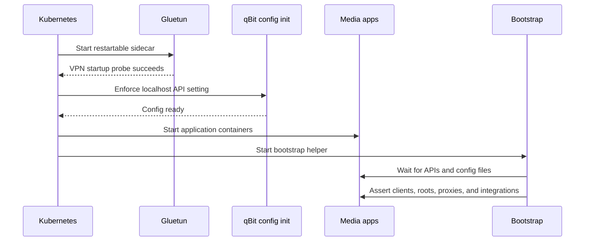

# Component catalog

This catalog covers every component declared by the production platform chart and the important
containers within each application. The definitive configuration remains under
`platform/components/`.

## Platform components

| Component | Namespace | Source | Wave | Responsibility |
| --- | --- | --- | ---: | --- |
| `namespaces` | `argocd` | Local resources | 1 | Creates `networking`, `media`, `photos`, and `secrets` |
| `metallb` | `networking` | Helm `0.15.3` + resources | 20/21 | Advertises stable LAN LoadBalancer addresses using L2 |
| `argocd` | `argocd` | Local resources | 23 | Adds a stable `10.0.0.200` LAN Service without patching upstream manifests |
| `storage` | `media` | Local resources | 41 | Defines local storage classes, PVs, and bulk-data PVCs |
| `sealed-secrets` | `secrets` | Helm `2.19.1` | 60 | Decrypts committed SealedSecrets into namespace Secrets |
| `media-stack` | `media` | Local resources | 81 | Runs the VPN-sharing automation pod and its services |
| `homarr` | `media` | Local resources | 83 | Runs the dashboard independently on the apps worker |
| `jellyfin` | `media` | Local resources | 85 | Streams the media library directly over the LAN |
| `immich` | `photos` | Local resources | 87 | Runs photo storage, API, database, cache, and ML |

The `tailscale` resources-only component is also present but commented out in production values.
When enabled at wave 25, it runs a subnet router in `networking`; see
[Tailscale remote access](tailscale.md).

The `infrastructure` AppProject can target all namespaces and cluster resources. The
`applications` AppProject is restricted to `media` and `photos`, with Namespace as its only
cluster-scoped allow-list entry.

## Media stack

The `media-stack` Deployment is pinned to `homelab.charles/pool=media`, uses `Recreate`, and shares
one pod network namespace. Its configuration PVCs use `config-local-retain`; its shared data volume
uses `media-local`.

| Container | Image policy | Port | Persistent state | Role |
| --- | --- | ---: | --- | --- |
| Gluetun | Pinned `v3.41.1` | internal control ports | None | Proton WireGuard tunnel, firewall, kill switch, NAT-PMP port forwarding |
| qBittorrent config init | Pinned BusyBox `1.37` | — | qBittorrent config PVC | Enables localhost API bypass while preserving LAN WebUI authentication |
| Radarr | Pinned LinuxServer release | `7878` | 512 Mi config + shared `/data` | Movie library automation |
| Sonarr | Pinned LinuxServer release | `8989` | 512 Mi config + shared `/data` | TV library automation |
| Prowlarr | Pinned LinuxServer release | `9696` | 512 Mi config | Indexer management and Arr synchronization |
| qBittorrent | Pinned LinuxServer release | `8080` | 512 Mi config + shared `/data` | VPN-bound downloads |
| FlareSolverr | Pinned `v3.5.0` | `8191` | None | Internal anti-bot proxy for compatible indexers |
| Bazarr | `latest` | `6767` | 512 Mi config + shared `/data` | Subtitle automation |
| Seerr | `latest` | `5055` | 512 Mi config | Media requests and discovery |
| Bootstrap | Python `3.13-slim` | — | Read-only app configs + shared `/data` | Idempotently wires local APIs and optionally provisions Homarr |
| Maintainerr | `latest` | `6246` | 512 Mi config | Library retention and maintenance rules |

The workload starts in this order:

### Automated wiring

The bootstrap helper continuously and idempotently configures:

- qBittorrent categories, download paths, LAN credentials, and Proton's forwarded listen port.
- qBittorrent as the Radarr and Sonarr download client.
- `/data/library/movies` and `/data/library/tv` as Arr root folders.
- Radarr and Sonarr as Prowlarr applications.
- FlareSolverr as Prowlarr's proxy.
- Radarr and Sonarr connections in Bazarr.
- Jellyfin library-update notifications in Radarr and Sonarr.
- Seerr's Jellyfin admin, enabled libraries, and default Radarr/Sonarr instances.
- Maintainerr's Jellyfin, Radarr, Sonarr, Seerr, and qBittorrent connections.
- Homarr tiles, integrations, board, and widgets once its API key exists.

Jellyfin and Homarr need initial admin accounts before their API keys can be added and resealed.
Once those values exist, Seerr and Maintainerr are configured without browser wizards. External
Prowlarr indexer providers still require an explicit provider choice and any provider credentials.
The full procedure is in [First-run application wiring](configuration.md).

## Homarr

Homarr is deliberately its own component, Deployment, Service, PVC, and Argo CD Application.

| Property | Value |
| --- | --- |
| Placement | `k3s-apps-01` via pool label `apps` |
| LAN address | `http://10.0.0.220` |
| Container port | `7575`, exposed as service port `80` |
| Persistent path | `/appdata` on a 1 Gi `config-local-retain` PVC |
| Secret | `homarr-secrets` SealedSecret |
| Resources | request `100m / 256Mi`; limit `1 CPU / 1Gi` |

Keeping Homarr outside the VPN pod gives it an independent lifecycle and keeps dashboard traffic
direct. The media bootstrap talks to it over Kubernetes service DNS.

## Jellyfin

Jellyfin is a standalone Deployment on the media worker.

| Property | Value |
| --- | --- |
| Placement | `k3s-media-01` via pool label `media` |
| LAN address | `http://10.0.0.230:8096` |
| Configuration | 2 Gi retained local PVC mounted at `/config` |
| Cache | 3 Gi retained local PVC mounted at `/cache` |
| Library | Shared media PV mounted read-only at `/media` |
| Resources | request `300m / 768Mi`; limit `4 CPU / 3Gi` |
| Transcoding | CPU by default; Intel iGPU is not passed through yet |

The read-only library mount keeps Jellyfin from modifying the files owned by Radarr and Sonarr.
Its LAN stream never traverses Gluetun.

## Immich

Immich runs as four cooperating workloads in `photos`, all pinned to the media worker because its
database PVC and bulk photo PV are node-local.

| Workload | Exposure | State | Resource request / limit | Role |
| --- | --- | --- | --- | --- |
| `immich-server` | LAN `10.0.0.240:80` | Shared photo PV | `200m/512Mi` · `2 CPU/2Gi` | API, web UI, jobs, uploads |
| `immich-postgres` | Cluster `5432` | 8 Gi retained PVC | `200m/512Mi` · `2 CPU/1536Mi` | Authoritative metadata database |
| `immich-valkey` | Cluster `6379` | Disposable | `50m/64Mi` · `500m/512Mi` | Queue/cache data |
| `immich-machine-learning` | Cluster `3003` | 2 Gi model cache PVC | `200m/1Gi` · `3 CPU/3Gi` | Face recognition and smart search |

The `immich-database` SealedSecret supplies the server and Postgres with matching database values.
Photo originals live under `/mnt/data/photos`; the database must be backed up separately because
the files alone do not reconstruct albums, users, or metadata.

## Supporting controllers

### MetalLB

MetalLB is installed from its upstream chart, then the component's `resources/` Application creates
two manually assigned address pools and one L2Advertisement. No service receives an address unless
its manifest requests one explicitly.

### Sealed Secrets

The controller watches `SealedSecret` objects and creates ordinary Kubernetes Secrets only inside
the cluster. Ciphertext is safe to publish; the controller private key is not. Details and recovery
steps are in [Secret management](secrets.md).

### Argo CD

Argo CD itself is bootstrapped by `scripts/bootstrap.ps1`, not by its own Application. After that,
the `homefallout-root` Application owns the platform chart and all child Applications. The local
repository credential is currently an SSH deploy key stored in a gitignored Kubernetes Secret.
The `argocd` component owns only a second LoadBalancer Service at `10.0.0.200`; keeping that Service
separate lets future upstream manifest refreshes remain untouched.

### Tailscale (staged)

The disabled Tailscale Deployment advertises `10.0.0.0/24`, `10.42.0.0/16`, and `10.43.0.0/16`
from a single subnet router. It requests `NET_ADMIN`, mounts `/dev/net/tun`, persists identity in a
512 Mi retained PVC, and offers optional exit-node routing. Its auth key is sealed in Git, but the
Application is not rendered until the component block is uncommented and its routes are approved
in the Tailscale admin console.

## Image update policy

Infrastructure chart versions and several sensitive media images are pinned. Some user-facing
applications currently track `latest` or `release`. Renovate is configured at repository root to
surface dependency updates, but updates should still be reviewed and verified. For safer rollback,
move remaining floating tags to explicit versions as the lab matures.
