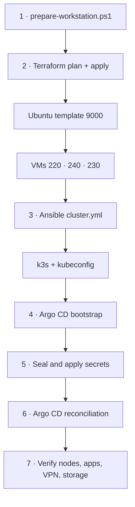

# Deployment runbook

This runbook builds the complete lab from the Windows laptop. The happy path is two PowerShell
commands; the rest of this guide explains what they do, how to verify them, and where to resume.

## Before you begin

You need:

- Proxmox VE reachable at `https://10.0.0.254:8006`.
- `local` storage configured for **Disk image** and **Import** content.
- Enough free capacity on `local` and `local-lvm`; check [Storage](storage.md).
- A dedicated Proxmox `terraform@pve!homefallout` API token.
- Router DHCP exclusions for `10.0.0.10-12` and `10.0.0.200-250`.
- Git, GitHub CLI authentication, PowerShell, and Ubuntu 24.04 WSL on this laptop.
- A Proton VPN WireGuard private key with NAT-PMP enabled on the selected configuration.

The exact Proxmox role and token commands are in [Proxmox prerequisites](proxmox-prerequisites.md).
Do not paste secrets into issues, commits, screenshots, or chat logs.

## End-to-end flow



## 1. Prepare the workstation

Run from the repository root in PowerShell:

```powershell
.\scripts\prepare-workstation.ps1
```

The script:

1. Finds or installs Terraform.
2. Downloads a repository-local `kubeseal` binary when needed.
3. Creates `~/.ssh/homefallout_ed25519` for VM access.
4. Creates a separate `~/.ssh/homefallout_argocd_ed25519` deploy key.
5. Creates a gitignored Argo CD repository Secret.
6. Prompts for the Proxmox token and writes gitignored `terraform.tfvars`.
7. Generates the k3s cluster token and application secret sources.
8. Confirms Ubuntu 24.04 WSL is available for Ansible.

Expected local-only files include:

```text
provisioning/terraform/terraform.tfvars
platform/secrets/media-secrets.yaml
platform/secrets/immich-secrets.yaml
platform/secrets/argocd-repository.yaml
platform/secrets/tailscale-secrets.yaml
```

All are ignored by Git. `platform/secrets/*.example.yaml` documents the schema without live values.
The Tailscale source is prepared for the staged remote-access component but is unused until that
component is explicitly enabled.

## 2. Deploy the stack

```powershell
.\scripts\deploy.ps1
```

### Terraform phase

Terraform downloads the current Ubuntu 24.04 cloud image through Proxmox, creates stopped template
VMID `9000`, and creates full clones `220`, `240`, and `230`. It attaches the 600 GB raw
`local-lvm` disk only to the media worker and generates
`provisioning/ansible/inventory.generated.yml`.

The deployment prints a saved plan and waits ten seconds before applying. Read the plan. A normal
first plan creates one download object, one template, three VMs, and one local inventory file.

The resources use `prevent_destroy`. Terraform will reject accidental destructive changes rather
than silently replacing a VM that carries state.

### Ansible phase

The script waits for SSH on all three nodes, copies the private SSH key into WSL with safe
permissions, installs `ansible-core` if necessary, and runs:

```bash
ansible-playbook -i inventory.generated.yml playbooks/cluster.yml
```

The playbook waits for cloud-init, installs prerequisites and `qemu-guest-agent`, locates the data
disk by serial, formats it only when blank, mounts it at `/mnt/data`, creates the media/photo tree,
installs the k3s server and agents, labels/taints nodes, and fetches the admin kubeconfig.

### GitOps phase

The deployment then:

1. Installs Argo CD with the upstream stable manifest.
2. Applies the local repository credential and `homefallout-root` Application.
3. Waits for namespaces and the Sealed Secrets controller.
4. Seals plaintext source Secrets using this cluster's public certificate.
5. Applies the generated encrypted resources so workloads can start.
6. Exports the controller key to a gitignored backup file.

Commit the generated `sealed-secret-*.yaml` resources after reviewing them. Argo CD then owns them
permanently. Copy the controller-key backup to encrypted storage outside this server.

## 3. Enable QEMU guest reporting

The Ubuntu cloud image does not initially contain `qemu-guest-agent`, so Terraform's first apply
leaves the virtual guest-agent channel disabled. After Ansible installs and starts the package, set:

```hcl
qemu_guest_agent_enabled = true
```

in the gitignored `provisioning/terraform/terraform.tfvars`, then run:

```powershell
terraform -chdir=provisioning/terraform plan
terraform -chdir=provisioning/terraform apply
```

Reboot the VMs if Proxmox does not immediately show agent-backed IP/filesystem details. The agent
is useful for Proxmox operations but is not required by Kubernetes.

## 4. Verify the deployment

Use the wrapper so this lab's kubeconfig does not replace Docker Desktop or another cluster:

```powershell
.\scripts\k.ps1 get nodes -o wide
.\scripts\k.ps1 get pods -A
.\scripts\k.ps1 get applications -n argocd
.\scripts\k.ps1 get svc -A
.\scripts\k.ps1 get pvc -A
```

Expected result:

- Three nodes are `Ready`; the control plane is a server and both workers are agents.
- Argo CD Applications are `Synced` and `Healthy` after their dependencies settle.
- All PVCs are `Bound`.
- MetalLB services hold the addresses documented in [Networking](networking.md).
- All application Deployments become available.

Inspect the core workloads:

```powershell
.\scripts\k.ps1 rollout status -n media deploy/media-stack --timeout=10m
.\scripts\k.ps1 rollout status -n media deploy/homarr --timeout=5m
.\scripts\k.ps1 rollout status -n media deploy/jellyfin --timeout=5m
.\scripts\k.ps1 rollout status -n photos deploy/immich-server --timeout=10m
```

Finally, prove qBittorrent shares Gluetun's VPN address using the commands in
[Networking](networking.md). Do not add downloads until that check passes.

## 5. Finish the browser setup

1. Create the initial Homarr admin and API key.
2. Complete Jellyfin's wizard, add movie/TV libraries from `/media/library`, and create an API key.
3. Put both API keys in the gitignored media secret source, reseal, commit, and restart the media
   stack bootstrap.
4. Complete Seerr and Maintainerr's interactive wizards.
5. Create the first Immich administrator and test an upload.

See [First-run application wiring](configuration.md) for exact paths and commands.

Private remote access is optional and remains disabled after the normal deployment. Follow the
[Tailscale runbook](tailscale.md) only after the LAN deployment is healthy.

## Safe reruns and partial runs

The scripts are designed to be rerun. Terraform, Ansible, sealing, and Argo reconciliation are
idempotent within their ownership boundaries.

```powershell
# Reconfigure guests and reconcile GitOps without changing Proxmox
.\scripts\deploy.ps1 -SkipTerraform

# Only bootstrap/reconcile after infrastructure is known good
.\scripts\deploy.ps1 -SkipTerraform -SkipAnsible

# Only run infrastructure and guest configuration
.\scripts\deploy.ps1 -SkipGitOps
```

Use skip switches only when the skipped layer already exists and its outputs are present. In
particular, Ansible requires the generated inventory, and GitOps requires the fetched kubeconfig.

## Manual route

The automated script is preferred, but the layers can be run independently:

```powershell
terraform -chdir=provisioning/terraform init
terraform -chdir=provisioning/terraform plan -out homefallout.tfplan
terraform -chdir=provisioning/terraform apply homefallout.tfplan
```

Then run Ansible inside WSL, followed by:

```powershell
.\scripts\bootstrap.ps1
.\scripts\seal-secrets.ps1
.\scripts\backup-sealing-key.ps1
```

The manual path requires you to apply newly generated SealedSecrets and wait for dependencies in
the same order as `deploy.ps1`. Use it for diagnosis, not as a shortcut around a failed layer.

## Rebuild boundary

Terraform and Git can reconstruct compute and Kubernetes objects. They cannot reconstruct user
data, databases, application config, the Sealed Secrets private key, or initial UI accounts. A real
rebuild therefore needs the external backup set described in [Operations](operations.md).
