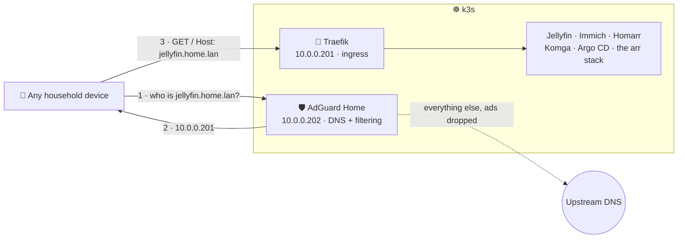

# DNS and ingress

Two components that only make sense together. **Traefik** (`10.0.0.201`) is the cluster's
ingress controller and routes by hostname; **AdGuard Home** (`10.0.0.202`) filters ads for every
device in the house and answers `*.home.lan` with Traefik's address, which is what makes those
hostnames resolve at all.

The result is that `http://jellyfin.home.lan` replaces `http://10.0.0.230:8096`, and nobody has to
remember which of eleven addresses is Bazarr.



k3s ships Traefik and this lab deliberately disables it (`k3s_disable` in
[group_vars/all.yml](../provisioning/ansible/group_vars/all.yml)), so before this there was no
ingress at all. It is installed here as a normal chart component, which keeps the version and its
values in Git rather than in an Ansible flag.

## The routing table

Every name points at `10.0.0.201`. The direct addresses all still work and are the way back in when
DNS is broken.

| Hostname | Goes to | Still reachable at |
| --- | --- | --- |
| `home.lan` | Homarr, so the bare name is the one thing to remember | — |
| `homarr.home.lan` | Homarr | `10.0.0.220` |
| `jellyfin.home.lan` | Jellyfin | `10.0.0.230:8096` |
| `komga.home.lan` | Komga | `10.0.0.239:25600` |
| `seerr.home.lan` | Seerr | `10.0.0.236` |
| `immich.home.lan` | Immich | `10.0.0.240` |
| `argocd.home.lan` | Argo CD | `10.0.0.200` |
| `adguard.home.lan` | AdGuard Home | `10.0.0.202:3000` |
| `radarr` `sonarr` `prowlarr` `bazarr` `mylar` `maintainerr` `qbittorrent` `.home.lan` | The automation tier | `10.0.0.231-238` |

Routing the arr apps through Traefik does **not** take their traffic outside Gluetun. The Ingress
reaches the same cluster Services the LAN addresses already use; the VPN boundary is inside the
media-stack pod and is untouched by any of this.

## Bringing it up

Argo CD syncs both components automatically once they are on `main`. Two things still need a human.

### 1. AdGuard's first run

Open `http://10.0.0.202:3000` and walk the wizard.

> **Set the admin interface port to 3000, not the default 80.** The Service and the Ingress both
> target 3000. If you accept 80, the container stops listening where Kubernetes is looking, the
> readiness probe never passes, and the pod sits `0/1 Running` forever. That is the symptom to
> recognise; the fix is to redo the wizard on 3000.

Leave the DNS server on port 53. Pick whatever upstream you like — the defaults are fine.

This is deliberately manual, matching the boundary the rest of the lab already draws: Homarr and
Immich admin users are set up by hand too, and only machine-to-machine wiring is automated.

### 2. The DNS rewrite that makes hostnames work

In AdGuard, **Filters → DNS rewrites**, add both:

| Domain | Answer |
| --- | --- |
| `home.lan` | `10.0.0.201` |
| `*.home.lan` | `10.0.0.201` |

The wildcard does not cover the bare name, which is why both entries are needed.

### 3. Point devices at it

Test one device first: set its DNS manually to `10.0.0.202`, confirm an ad-heavy page comes back
cleaner and `http://jellyfin.home.lan` opens. Staging it this way matters because a mistake here
takes the household's internet down, not just a service.

To cover everyone, set the DHCP-advertised DNS server on the router at `http://10.0.0.1` to
`10.0.0.202`. Devices pick it up on lease renewal; reconnecting Wi-Fi or rebooting the router makes
it immediate.

**Make AdGuard the only DNS server the router hands out.** The instinct to add a public resolver as
a secondary for resilience backfires: clients do not treat a secondary as failover-only. Windows and
Android query both and take whichever answers first, so ads leak through unpredictably and the
filtering becomes a coin flip. If you want redundancy, the answer is a second AdGuard, not a
non-filtering fallback.

That means accepting a real cost deliberately: if the apps worker is down, nobody in the house
resolves anything until you change the setting back. The router page is the escape hatch, and every
service keeps its original IP so the lab itself stays reachable.

## Before you flip the router

**AdGuard becomes a single point of failure for the entire house.** Not just for `.home.lan` — for
all name resolution. If the apps worker is down, or the pod is rescheduling, or you are mid-upgrade,
nobody can reach anything, including the internet. That is the real cost of network-wide filtering
and it is worth accepting deliberately rather than discovering at dinner time.

**The k3s VMs are already safe from the circular dependency this would otherwise invite.** Terraform
gives them static DNS through cloud-init rather than DHCP:

```hcl
variable "nameservers" {
  default = ["10.0.0.1", "1.1.1.1"]
}
```

So `10.0.0.10-12` resolve through the router and Cloudflare no matter what DHCP advertises, and
never depend on a pod running inside the cluster they are booting. Nothing to do here — just do not
undo it by configuring DNS inside the guests.

The remaining exposure is the household one, and there is no clever way around it: one pod answers
for everyone. Keep the router's admin page reachable, and remember that reverting is a one-field
change.

## Reaching it over Tailscale

Devices on the tailnet can already *reach* `10.0.0.201` — the subnet router advertises
`10.0.0.0/24`. What they cannot do is resolve `home.lan`, because they use their own local resolver
and the router's DHCP setting only reaches devices on the home Wi-Fi.

Fix it with split DNS, in the Tailscale admin console under **DNS → Nameservers → Add nameserver →
Custom**: enter `10.0.0.202`, turn on **Restrict to domain**, and enter `home.lan`. MagicDNS must be
enabled.

Only `*.home.lan` queries then travel to AdGuard over the tailnet; every other lookup stays on the
device's own resolver. That restriction matters on cellular — without it you would backhaul a
phone's entire DNS through the house.

This deliberately does not extend ad filtering to roaming devices. Doing that means sending all
their DNS home, which is a different tradeoff and a much slower one away from the LAN.

**Check the tailnet ACLs before assuming this works for everyone.** If family devices are narrowed
to `10.0.0.230-240` as [Tailscale remote access](tailscale.md) suggests, hostnames will neither
resolve nor route for them: AdGuard is at `.202` and Traefik at `.201`, both outside that range.
Either add those two addresses to the ACL, or leave those users on the direct IPs.

## qBittorrent

qBittorrent can validate the `Host` header and answer `401 Unauthorized` to a name it does not
recognise. On this cluster it does not: `qbittorrent.home.lan` was tested through Traefik and
returned its real WebUI, so no configuration is needed.

Worth knowing anyway, because it is the one service here with a failure mode that looks like a
routing bug but is not. If it ever starts answering 401 on the hostname while `10.0.0.234` still
works, the fix is **Tools → Options → Web UI → "Server domains"**: add `qbittorrent.home.lan`.

Everything else routes without configuration.

## Verifying

```powershell
.\scripts\k.ps1 get ingress -A
.\scripts\k.ps1 -n networking get svc traefik adguard
.\scripts\k.ps1 -n networking get pods
```

Every Ingress should show `10.0.0.201` in ADDRESS, and both Services should hold their assigned
LoadBalancer IPs. To test routing before DNS is in place, bypass resolution entirely:

```bash
curl -H "Host: jellyfin.home.lan" http://10.0.0.201/
```

A `200` or a redirect means Traefik is routing correctly and anything still broken is DNS.

Once the rewrites exist, this tests the whole chain, taking the address from AdGuard rather than
hardcoding it — which is what a browser does:

```bash
for h in home.lan jellyfin.home.lan immich.home.lan argocd.home.lan; do
  ip=$(nslookup "$h" 10.0.0.202 | awk '/^Address/{a=$2} END{print a}')
  code=$(curl -s -o /dev/null -w "%{http_code}" --resolve "$h:80:$ip" "http://$h/")
  printf '%-24s %-12s HTTP %s
' "$h" "$ip" "$code"
done
```

Redirects are healthy: Jellyfin answers 302 to `/web/`, Argo CD and Seerr 307 to their login pages,
Mylar 303. Only a connection failure or a 404 is a real problem.

## Backing out

Point the router's DNS back at whatever it was; every service is still on its original address and
nothing depends on the hostnames. To remove the components entirely, set `resources.enabled: false`
(or delete the entry) in [values-prod.yaml](../platform/values/values-prod.yaml) and let Argo CD
prune them.

Removing Traefik does not affect the LoadBalancer addresses. Removing AdGuard while the router is
still handing out `10.0.0.202` breaks DNS for the house — change the router first.

## Why HTTP and no certificates

This is a LAN-only lab with no public exposure, and the alternatives both cost more than they
return here: a self-signed CA means installing a certificate on every phone and laptop before
anything loads without a warning, and Let's Encrypt needs a domain you own plus a DNS API token in
a sealed secret. Plain HTTP matches the posture the rest of the lab already has.

TLS can be added later without touching a single Ingress rule — it is a Traefik values change and a
`tls:` block, not a redesign.
