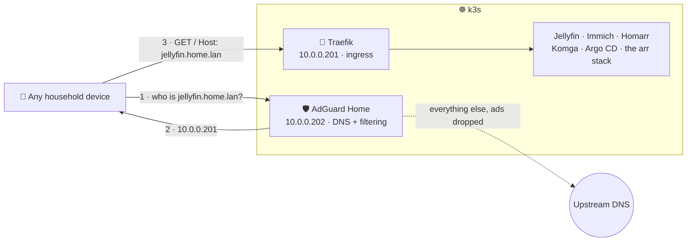

# DNS and ingress

Two components that only make sense together. **Traefik** (`10.0.0.201`) is the cluster's
ingress controller and routes by hostname; **AdGuard Home** (`10.0.0.202`) filters ads for every
device in the house and answers `*.home.lan` with Traefik's address, which is what makes those
hostnames resolve at all.

The result is that `http://jellyfin.home.lan` replaces `http://10.0.0.230:8096`, and nobody has to
remember which of eleven addresses is Bazarr.



k3s ships Traefik and this lab deliberately disables it (`k3s_disable` in
[group_vars/all.yml](../provisioning/ansible/group_vars/all.yml)), so before this there was no
ingress at all. It is installed here as a normal chart component, which keeps the version and its
values in Git rather than in an Ansible flag.

## The routing table

Every name points at `10.0.0.201`. The direct addresses all still work and are the way back in when
DNS is broken.

| Hostname | Goes to | Still reachable at |
| --- | --- | --- |
| `home.lan` | Homarr, so the bare name is the one thing to remember | — |
| `homarr.home.lan` | Homarr | `10.0.0.220` |
| `jellyfin.home.lan` | Jellyfin | `10.0.0.230:8096` |
| `komga.home.lan` | Komga | `10.0.0.239:25600` |
| `seerr.home.lan` | Seerr | `10.0.0.236` |
| `immich.home.lan` | Immich | `10.0.0.240` |
| `argocd.home.lan` | Argo CD | `10.0.0.200` |
| `adguard.home.lan` | AdGuard Home | `10.0.0.202:3000` |
| `radarr` `sonarr` `prowlarr` `bazarr` `mylar` `maintainerr` `qbittorrent` `.home.lan` | The automation tier | `10.0.0.231-238` |

Routing the arr apps through Traefik does **not** take their traffic outside Gluetun. The Ingress
reaches the same cluster Services the LAN addresses already use; the VPN boundary is inside the
media-stack pod and is untouched by any of this.

## Bringing it up

Argo CD syncs both components automatically once they are on `main`. Two things still need a human.

### 1. AdGuard's first run

Open `http://10.0.0.202:3000` and walk the wizard.

> **Set the admin interface port to 3000, not the default 80.** The Service and the Ingress both
> target 3000. If you accept 80, the container stops listening where Kubernetes is looking, the
> readiness probe never passes, and the pod sits `0/1 Running` forever. That is the symptom to
> recognise; the fix is to redo the wizard on 3000.

Leave the DNS server on port 53. Pick whatever upstream you like — the defaults are fine.

This is deliberately manual, matching the boundary the rest of the lab already draws: Homarr and
Immich admin users are set up by hand too, and only machine-to-machine wiring is automated.

### 2. The DNS rewrite that makes hostnames work

In AdGuard, **Filters → DNS rewrites**, add both:

| Domain | Answer |
| --- | --- |
| `home.lan` | `10.0.0.201` |
| `*.home.lan` | `10.0.0.201` |

The wildcard does not cover the bare name, which is why both entries are needed.

### 3. Point devices at it

Test on one device before touching the router: set its DNS manually to `10.0.0.202`, then confirm
an ad-heavy page is cleaner and `http://jellyfin.home.lan` opens. Only then change the router's
DHCP to hand out `10.0.0.202` as the DNS server for the LAN.

Staging it this way matters because a mistake here takes the whole household's internet down, not
just a service.

## Before you flip the router

**AdGuard becomes a single point of failure for the entire house.** Not just for `.home.lan` — for
all name resolution. If the apps worker is down, or the pod is rescheduling, or you are mid-upgrade,
nobody can reach anything, including the internet. That is the real cost of network-wide filtering
and it is worth accepting deliberately rather than discovering at dinner time.

Two mitigations worth taking:

- **Give the router a second DNS server** that is not AdGuard (for example `1.1.1.1`). Clients fall
  back when AdGuard is unreachable. The tradeoff is that some clients will occasionally use the
  fallback and see ads.
- **Do not let the three k3s VMs resolve through AdGuard.** They currently take DNS from DHCP, so
  handing out `10.0.0.202` to everything points them at a pod that runs *on* the cluster they are
  booting. Images are usually cached so a cold boot normally works, but it is a circular dependency
  waiting for a bad day. Give `10.0.0.10-12` static DNS at the router, or a static reservation
  pointing at the router's own resolver.

## qBittorrent needs one extra step

qBittorrent validates the `Host` header and answers `401 Unauthorized` to a name it does not
recognise, so `qbittorrent.home.lan` will not work until you tell it that name is legitimate:
**Tools → Options → Web UI → "Server domains"**, add `qbittorrent.home.lan` (or `*`).

Everything else routes without configuration.

## Verifying

```powershell
.\scripts\k.ps1 get ingress -A
.\scripts\k.ps1 -n networking get svc traefik adguard
.\scripts\k.ps1 -n networking get pods
```

Every Ingress should show `10.0.0.201` in ADDRESS, and both Services should hold their assigned
LoadBalancer IPs. To test routing before DNS is in place, bypass resolution entirely:

```bash
curl -H "Host: jellyfin.home.lan" http://10.0.0.201/
```

A `200` or a redirect means Traefik is routing correctly and anything still broken is DNS.

## Backing out

Point the router's DNS back at whatever it was; every service is still on its original address and
nothing depends on the hostnames. To remove the components entirely, set `resources.enabled: false`
(or delete the entry) in [values-prod.yaml](../platform/values/values-prod.yaml) and let Argo CD
prune them.

Removing Traefik does not affect the LoadBalancer addresses. Removing AdGuard while the router is
still handing out `10.0.0.202` breaks DNS for the house — change the router first.

## Why HTTP and no certificates

This is a LAN-only lab with no public exposure, and the alternatives both cost more than they
return here: a self-signed CA means installing a certificate on every phone and laptop before
anything loads without a warning, and Let's Encrypt needs a domain you own plus a DNS API token in
a sealed secret. Plain HTTP matches the posture the rest of the lab already has.

TLS can be added later without touching a single Ingress rule — it is a Traefik values change and a
`tls:` block, not a redesign.
