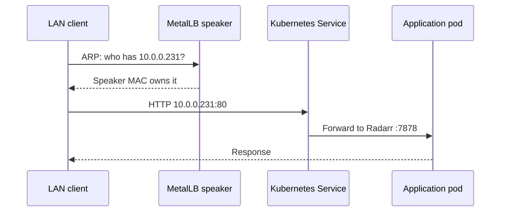
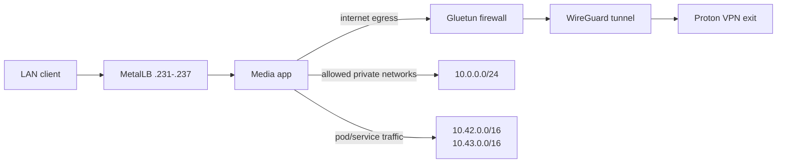

# Networking

The lab is a flat, LAN-first design. VM addresses and MetalLB addresses live on the same
`10.0.0.0/24` network as the Windows workstation. k3s uses separate internal pod and service
networks, while Gluetun changes only the media pod's outbound route.

## Address plan

| Range / address | Owner | Use |
| --- | --- | --- |
| `10.0.0.1` | Router | Default gateway, local DNS, DHCP |
| `10.0.0.10` | Terraform | `k3s-cp-01` and Kubernetes API `:6443` |
| `10.0.0.11` | Terraform | `k3s-apps-01` |
| `10.0.0.12` | Terraform | `k3s-media-01` |
| `10.0.0.200-229` | MetalLB `platform` pool | Platform and dashboard services |
| `10.0.0.230-250` | MetalLB `media-and-photos` pool | Media and photo services |
| `10.0.0.254` | Proxmox | Hypervisor UI and API `:8006` |
| `10.42.0.0/16` | k3s | Pod addresses |
| `10.43.0.0/16` | k3s | ClusterIP service addresses |

Configure the router's DHCP pool to end at or below `10.0.0.199`. Do not create DHCP reservations
inside either MetalLB pool. The `.200-.250` range is reserved even when many addresses are unused.

This is a real prerequisite, not a formality: the Helix shipped handing out `10.0.0.2-253`, which
covered every MetalLB address and the three k3s VMs, and was corrected to `10.0.0.100-199`. Starting
at `.100` also keeps DHCP away from the statically addressed VMs at `.10-.12`. The gateway exposes
no DNS setting on any page, so LAN-wide DNS cannot be pushed from it; see
[DNS and ingress](dns-and-ingress.md).

## Published services

| Address | Service port | Pod target | Namespace | Route |
| --- | ---: | ---: | --- | --- |
| `10.0.0.200` | `80`, `443` | Argo CD server `8080` | `argocd` | Direct |
| `10.0.0.201` | `80` | Traefik ingress, routes `*.home.lan` | `networking` | Direct |
| `10.0.0.202` | `53` TCP+UDP, `3000` | AdGuard Home DNS and UI | `networking` | Direct |
| `10.0.0.220` | `80` | Homarr `7575` | `media` | Direct |
| `10.0.0.230` | `8096` | Jellyfin `8096` | `media` | Direct |
| `10.0.0.231` | `80` | Radarr `7878` | `media` | VPN pod |
| `10.0.0.232` | `80` | Sonarr `8989` | `media` | VPN pod |
| `10.0.0.233` | `80` | Prowlarr `9696` | `media` | VPN pod |
| `10.0.0.234` | `80` | qBittorrent `8080` | `media` | VPN pod |
| `10.0.0.235` | `80` | Bazarr `6767` | `media` | VPN pod |
| `10.0.0.236` | `80` | Seerr `5055` | `media` | VPN pod |
| `10.0.0.237` | `80` | Maintainerr `6246` | `media` | VPN pod |
| `10.0.0.238` | `80` | Mylar `8090` | `media` | VPN pod |
| `10.0.0.239` | `25600` | Komga `25600` | `media` | Direct |
| `10.0.0.240` | `80` | Immich `2283` | `photos` | Direct |

FlareSolverr, Immich Postgres, Valkey, and machine learning are ClusterIP-only. They are reachable
by other cluster workloads, not directly from the LAN.

## How MetalLB L2 works here

MetalLB assigns the exact address requested by each Service annotation. A speaker answers ARP for
that address on `vmbr0`, and Kubernetes forwards the connection to the selected pod. There is no
router port forward, cloud load balancer, or separate appliance.



All pools have `autoAssign: false`; the manifest must request an address. This prevents a newly
created LoadBalancer Service from unexpectedly consuming a memorable LAN IP.

## VPN routing boundary

Gluetun is a restartable init container in the same pod as the media applications. All containers
in that pod share interfaces, routes, and firewall rules. Their internet traffic therefore leaves
through WireGuard, and Gluetun's kill switch blocks normal internet egress when the tunnel is down.



Gluetun explicitly allows all three private ranges so LAN UIs, Kubernetes DNS/services, and the
bootstrap connections continue to work. Proton NAT-PMP supplies a forwarded port; Gluetun updates
qBittorrent's listen port when it changes.

Verify the boundary before downloading:

```powershell
.\scripts\k.ps1 exec -n media deploy/media-stack -c gluetun -- wget -qO- https://ipinfo.io
.\scripts\k.ps1 exec -n media deploy/media-stack -c qbittorrent -- wget -qO- https://ipinfo.io
```

The two public IPs must match and must not be the home's public address.

## DNS

Kubernetes workloads use service DNS names such as:

```text
radarr.media.svc.cluster.local
homarr.media.svc.cluster.local
immich-postgres.photos.svc.cluster.local
```

LAN clients currently use fixed IP addresses. Optional router/Pi-hole/AdGuard records can provide
names such as `jellyfin.home.arpa`, but those records are outside this repository. Prefer
`home.arpa`, the reserved home-network suffix, rather than inventing a public domain.

## Firewall and exposure model

- Services are intended only for trusted clients on `10.0.0.0/24`.
- No Kubernetes Ingress, TLS certificate automation, or WAN port forwarding is configured.
- qBittorrent's LAN WebUI requires the sealed username/password; only localhost inside the pod may
  bypass authentication for automation.
- FlareSolverr and data services do not have LoadBalancer addresses.
- The Proxmox UI and Kubernetes API should never be forwarded directly to the internet.

For remote access, the repository runs a Tailscale subnet router that exposes these private ranges
only to authenticated tailnet devices. Route and exit-node advertisements still require tailnet
approval unless policy auto-approvers cover them; see [Tailscale remote access](tailscale.md).
Treat public ingress as a separate project with TLS, identity, rate limits, and backups.

## Troubleshooting

| Symptom | Check |
| --- | --- |
| Service address does not answer | `.\scripts\k.ps1 get svc -A` and MetalLB speaker logs |
| Address remains pending | Requested IP is inside a declared pool and MetalLB resources are synced |
| UI opens locally but not from another device | Router client isolation, host firewall, and same-LAN connectivity |
| Media app cannot reach Kubernetes services | Gluetun allowed subnet list includes `10.42.0.0/16` and `10.43.0.0/16` |
| Media pod has home public IP | Stop downloads; inspect Gluetun readiness and logs immediately |
| Node cannot reach gateway | Cloud-init address, `vmbr0`, `/24` prefix, and gateway `10.0.0.1` |
