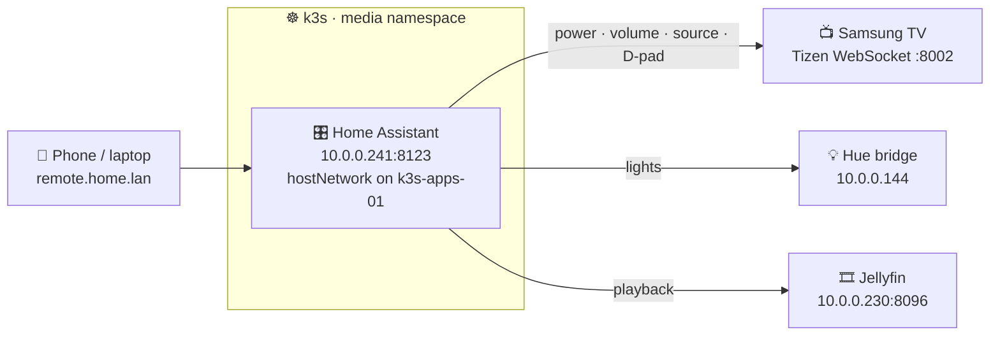

# The household remote

The TV's own remote is the worst interface in the house, and the Jellyfin kiosk's answer to it is a
keyboard on the coffee table ([TV console](tv-console.md)). This replaces both with a web app on the
server that anyone can open from a phone or a laptop: `http://remote.home.lan`.

It is Home Assistant, which is worth stating plainly because the name undersells it here. This is
not a home-automation project. It is being used as a universal remote, and it earns that job by
already speaking every control protocol in this house — the Samsung TV's Tizen WebSocket API, the
Hue bridge, and Jellyfin — with its own user accounts so roommates get access without getting admin.



## Why hostNetwork

This is the one component in the lab that takes the node's network instead of a pod IP, and the
reason is not performance.

Home Assistant finds devices with SSDP and mDNS. Both are multicast, and multicast does not cross
the pod network — from inside `10.42.0.0/16` the TV and the Hue bridge are simply invisible, and
every integration has to be added by hand. Turning the TV **on** is worse: that is a Wake-on-LAN
magic packet, a broadcast onto the LAN itself, which a NATed pod cannot send at all.

The cost is real and worth knowing. The pod binds `8123` directly on `k3s-apps-01`, so nothing else
may ever claim that port on that node, and Home Assistant sees the node's network with no isolation
between them.

## Deploy

Nothing to run by hand — this is GitOps like everything else under `platform/`. Commit and push, and
Argo CD syncs it at wave 90, after Komga and before the ingress:

```powershell
git add platform/ docs/
git commit -m "Add Home Assistant as the household remote"
git push
kubectl -n media rollout status deploy/home-assistant
```

First boot installs integration dependencies before it listens, which takes minutes on a small VM.
The startup probe allows ten of them.

| What it creates | Where |
| --- | --- |
| `home-assistant-config` | 5 Gi `config-local-retain` PVC on the apps node |
| Deployment | `k3s-apps-01`, hostNetwork, image pinned to `2026.8.2` |
| Service | LoadBalancer `10.0.0.241:8123` |
| Hostname | `remote.home.lan` via the ingress component |
| Dashboard tile | "Remote" on the Homarr board, from the media bootstrap |

### The reverse-proxy trap

Home Assistant behind a reverse proxy answers **400 Bad Request** to every login until it is told
which proxies to trust, and it accepts that setting from nowhere but `configuration.yaml`. On a
fresh volume that file does not exist yet, so an init container seeds it with the cluster CIDRs
already trusted. It writes the file **only when missing** — after first boot Home Assistant owns it
and hand edits are safe.

The trusted list is deliberately the pod and service CIDRs and nothing wider. Trusting the LAN would
let any device in the house forge its own source address in `X-Forwarded-For`.

## First run

Open `http://remote.home.lan` (or `http://10.0.0.241:8123`) and create the owner account. Use your
own admin credentials here, not `apps-admin` — this account can reconfigure everything.

Then add the roommates: **Settings → People → Add person**, with *Allow login* on, *Local access
only* on, and **Administrator off**. Same model as
[Charlotte's Jellyfin account](configuration.md): everyone can drive the TV, nobody else can rewire
it.

## Adding the TV

**The TV must be awake for this.** Tizen drops its network stack in standby, which is why a scan of
the LAN with the TV off finds nothing at all and looks like the TV is not connected.

Identified on 2026-08-20, straight from `http://10.0.0.163:8001/api/v2/`:

| Property | Value |
| --- | --- |
| Model | `QN55Q80TAFXZC` — Samsung Q80T, 55-inch, 2020 QLED |
| Name | `[TV] Television Salon` |
| Address | `10.0.0.163`, `networkType: wireless` |
| Wi-Fi MAC | `64:E7:D8:36:52:60` — the address Wake-on-LAN must target |
| Open ports | `8001` and `8002`, plus `9110/ip_control` and `9197/dmr` |
| `TokenAuthSupport` | `true`, so the integration uses the encrypted `8002` WebSocket and stores a token |
| `remote_available` | `true`, with `fourDirections`, `touchPad`, and `voiceControl` |

Give it a DHCP reservation on the router before relying on that address.

1. Turn the TV on.
2. **Settings → Devices & services → Add integration → Samsung Smart TV.**
3. It should be discovered on its own. If not, enter `10.0.0.163` by hand.
4. **Watch the TV screen.** It shows a one-time *Allow this device to connect?* prompt, and the
   integration hangs until someone accepts it. Accept, and the token is stored for good.

If the prompt is missed or refused, clear it on the TV under **Settings → General → External Device
Manager → Device Connect Manager → Device List** and try again.

This yields a `media_player` entity and — the useful one — a `remote` entity that takes raw key
codes. `remote.send_command` accepts the whole Tizen set:

| Function | Commands |
| --- | --- |
| Power / volume | `KEY_POWER`, `KEY_VOLUP`, `KEY_VOLDOWN`, `KEY_MUTE` |
| D-pad | `KEY_UP`, `KEY_DOWN`, `KEY_LEFT`, `KEY_RIGHT`, `KEY_ENTER` |
| Navigation | `KEY_RETURN`, `KEY_HOME`, `KEY_EXIT`, `KEY_MENU`, `KEY_TOOLS`, `KEY_INFO` |
| Input | `KEY_SOURCE`, `KEY_HDMI` |
| Playback | `KEY_PLAY`, `KEY_PAUSE`, `KEY_STOP`, `KEY_REWIND`, `KEY_FF` |

### Power off works; power on is the hard direction

Turning the TV off is just a WebSocket command. Turning it on cannot be, because the thing that
answers WebSockets is off. That needs Wake-on-LAN, and on Samsung sets it needs a setting enabled
first: **Settings → General (or General & Privacy) → Network → Expert Settings → Power On with
Mobile**.

The Home Assistant side usually needs nothing. The Samsung integration ships `wakeonlan` as its own
dependency and sends the magic packet itself when `turn_on` is called on the TV entity, using the
MAC it learned at setup. Try that before adding anything.

If it does not work, add the separate **Wake on LAN** integration pointed at `64:E7:D8:36:52:60` —
the TV's Wi-Fi MAC, read from its own API. It has a config flow, so it is added from **Settings →
Devices & services → Add integration** like any other; no YAML.

Note which of these lives where. *Power On with Mobile* is a firmware setting on the panel and can
only be set with the TV's own remote. Home Assistant cannot reach it.

Two things sink this in practice, so check them before concluding it is broken:

- **WoL over Wi-Fi is unreliable on Samsung TVs.** Some models honour it, some only wake from a
  wired connection. A wired drop to the TV fixes it properly and costs a cable.
- **Wi-Fi and Ethernet have different MACs.** This set reports `networkType: wireless`, so
  `64:E7:D8:36:52:60` is the right one — until someone runs a cable to it, which would change both
  the MAC and, helpfully, the reliability.

If power-on refuses to work, it is a small loss: the TV's own power button is the one button on the
bad remote that works fine.

## No add-ons here

This runs the Home Assistant **container**, not Home Assistant OS, so the add-on store does not
exist — no File Editor, no Terminal, no Studio Code Server. Nearly everything is UI-driven and this
rarely bites, but a file edit means going in through the pod:

```powershell
./scripts/k.ps1 -n media exec -it deploy/home-assistant -c home-assistant -- vi /config/configuration.yaml
```

`vi` is the only editor in the image. A restart to pick up a config change is
`./scripts/k.ps1 -n media rollout restart deploy/home-assistant`.

## Adding the lights and Jellyfin

**Hue** — `10.0.0.144`, discovered automatically. For lights that follow what is on screen
rather than just switching with it, see [Ambient lighting](ambient-lighting.md). Press the physical link button on the bridge when
asked. All local, no Philips cloud account.

**Jellyfin** — add by URL, `http://jellyfin.media.svc.cluster.local:8096`, with a normal user
account rather than the admin. This gives playback control over any Jellyfin session, including the
TV kiosk, so the app can drive what is playing as well as the panel it plays on.

## Building the actual remote

The default dashboard is a list of entities, which is not a remote. Make a proper one:
**Settings → Dashboards → Add dashboard**, then paste a grid of buttons in the raw YAML editor.
Check the real entity id first under **Developer tools → States**.

```yaml
type: grid
columns: 3
square: true
cards:
  - type: button
    name: "▲"
    show_icon: false
    tap_action:
      action: perform-action
      perform_action: remote.send_command
      target: { entity_id: remote.living_room_tv }
      data: { command: KEY_UP }
  - type: button
    name: "OK"
    show_icon: false
    tap_action:
      action: perform-action
      perform_action: remote.send_command
      target: { entity_id: remote.living_room_tv }
      data: { command: KEY_ENTER }
```

Repeat per button. Everything here is built in — no HACS, no custom cards.

Roommates reach it at `remote.home.lan` on the LAN. Off the LAN it comes through the
[Tailscale subnet router](tailscale.md) like everything else; do not port-forward `8123`.

## Troubleshooting

| Symptom | Likely cause |
| --- | --- |
| 400 Bad Request at login | `trusted_proxies` missing from `configuration.yaml`; see above |
| TV not discovered | TV is asleep — Tizen has no network in standby |
| Integration hangs on setup | The *allow this device* prompt is waiting on the TV screen |
| TV drops out after a while | DHCP moved it; give it a reservation on the router |
| Everything works but power-on | WoL over Wi-Fi, or the wrong MAC; see above |
| Pod will not schedule | Something else holds `8123` on `k3s-apps-01` |
| Lights found, TV not | Expected on a pod network — but this runs hostNetwork, so check the TV is awake |

## An unrelated finding

While scanning the LAN for the TV, `10.0.0.199` announced itself over SSDP as
`FIRETVSTICK2018-AMAZOAFTMM` — an Amazon Fire TV Stick 4K — with a MAC in Amazon's `1C:12:B0`
range. Charles says the household does not own one.

It may well be a roommate's. That is worth confirming before assuming otherwise, and worth not
ignoring if nobody claims it, because it is then a device with network access that nobody put there
on purpose. Recorded here rather than acted on.
