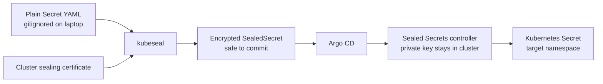

# Secret management

Plain Kubernetes Secrets live only under `platform/secrets/`, which is gitignored. Argo CD deploys
the Bitnami Sealed Secrets controller from `platform/components/sealed-secrets/values/`, and the
encrypted `SealedSecret` resources live beside their applications under `resources/`.



## Secret inventory

| Secret | Namespace | Consumer | Committed form |
| --- | --- | --- | --- |
| `gluetun-vpn` | `media` | Gluetun | `media-stack/resources/sealed-secret-gluetun-vpn.yaml` |
| `qbittorrent-auth` | `media` | qBittorrent + bootstrap | `media-stack/resources/sealed-secret-qbittorrent-auth.yaml` |
| `homarr-secrets` | `media` | Homarr + bootstrap | `homarr/resources/sealed-secret-homarr-secrets.yaml` |
| `immich-database` | `photos` | Immich server + Postgres | `immich/resources/sealed-secret-immich-database.yaml` |
| `tailscale-auth` | `networking` | Tailscale subnet router (staged, see docs/tailscale.md) | `tailscale/resources/sealed-secret-tailscale-auth.yaml` |

Every application credential declared by this repository is delivered through a SealedSecret.
Application-generated credentials may also exist inside retained config PVCs; protect those PVCs
with the same care as Kubernetes Secrets.

## First deployment

`scripts/deploy.ps1` handles the initial sequence:

1. Bootstrap Argo CD and the root Application.
2. Wait for `sealed-secrets-controller` in the `secrets` namespace.
3. Convert the existing plaintext inputs into cluster-bound encrypted manifests.
4. Apply those manifests so the workloads can start.
5. Export the controller's private sealing key to
   `platform/secrets/sealed-secrets-key-backup.yaml`.

Commit only these generated encrypted files:

```text
platform/components/media-stack/resources/sealed-secret-gluetun-vpn.yaml
platform/components/media-stack/resources/sealed-secret-qbittorrent-auth.yaml
platform/components/homarr/resources/sealed-secret-homarr-secrets.yaml
platform/components/immich/resources/sealed-secret-immich-database.yaml
platform/components/tailscale/resources/sealed-secret-tailscale-auth.yaml
```

Never commit `platform/secrets/*.yaml`, `terraform.tfvars`, or the controller-key backup.

Other local credentials are also gitignored: the generated Ansible inventory, kubeconfig, Argo CD
repository Secret, repository-local tools, and Terraform state/plan files. SSH private keys live in
the Windows user profile rather than this repository.

## Updating a secret

Edit or regenerate the gitignored plaintext input, reseal it, and commit the changed ciphertext:

```powershell
.\scripts\seal-secrets.ps1
git add platform/components/*/resources/sealed-secret-*.yaml
git commit -m "Update sealed application secrets"
git push
```

Strict sealing scope is used. A sealed value is bound to its Secret name and namespace, so renaming
or moving it requires resealing.

To rotate a value safely:

1. Generate the replacement without printing it into terminal history where practical.
2. Update only the gitignored source YAML.
3. Run the sealing script and inspect the diff: only ciphertext should change.
4. Commit and push the SealedSecret.
5. Restart the consuming Deployment if it does not reload Secrets automatically.
6. Revoke the previous credential at its provider or application.

Do not decode live Kubernetes Secrets for routine verification. Check key names and workload
readiness instead; use value access only when diagnosis genuinely requires it.

## Disaster recovery

The controller automatically renews sealing keys, and committed ciphertext cannot be decrypted
after a total cluster loss unless the relevant private key survives. After initial deployment and
occasionally after key renewal, run:

```powershell
.\scripts\backup-sealing-key.ps1
```

Copy the generated backup to an encrypted location outside the Proxmox host. Treat it like a master
password: anyone who gets it can recover the protected values. During a rebuild, restore the key
Secrets before relying on the committed `SealedSecret` files, then restart the controller.

## Public repository checklist

Before pushing a branch or making the repository public:

```powershell
git status --short
git diff --cached
gitleaks git --redact --no-banner
```

Confirm that only `kind: SealedSecret` resources—not ordinary `kind: Secret` values—exist under
committed component resources. Encryption protects the values, but names, namespaces, image names,
LAN addresses, and architecture remain intentionally public metadata.
