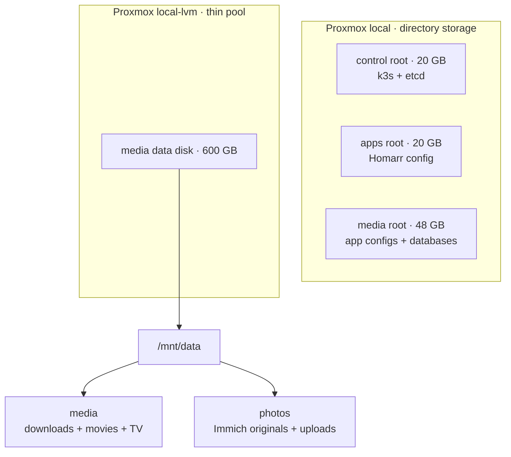
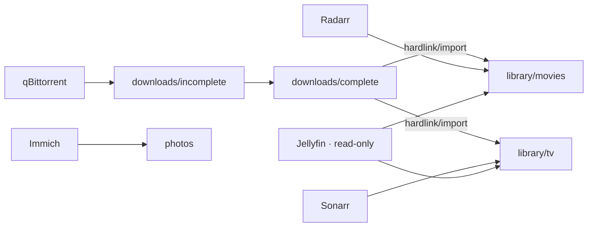

# Storage

This host has one physical NVMe, but the layout separates replaceable operating-system state,
application configuration, and large user data so their capacity and backup policies are clear.

| Proxmox storage | Virtual disk | Guest path | Purpose |
| --- | ---: | --- | --- |
| `local` | 20 GB | control `/` | Ubuntu, k3s control plane, and etcd |
| `local` | 20 GB | apps `/` | Ubuntu, images, and Homarr config PVC |
| `local` | 48 GB | media `/` | Ubuntu, images, and media/Immich config and database PVCs |
| `local-lvm` | 600 GB | media `/mnt/data` | Downloads, movies, TV, and Immich originals/uploads |

The remaining unallocated `local-lvm` capacity is deliberately reserved for future media/photo
growth. It is not consumed by application configuration.



## Persistent application state

K3s's local-path provisioner creates volumes under `/var/lib/rancher/k3s/storage` on the worker
where a pod is scheduled. Because every node OS disk is on Proxmox `local`, application config and
databases remain on `local`; node selectors keep each PVC with its intended worker. Every
application PVC explicitly selects `config-local-retain`.

This includes:

- Radarr, Sonarr, Prowlarr, qBittorrent, Bazarr, Seerr, and Maintainerr configuration.
- Homarr's `/appdata` volume.
- Jellyfin configuration and cache.
- Immich Postgres data and machine-learning cache.

| Workload | PVC(s) | Storage class | Scheduled node | Backup value |
| --- | --- | --- | --- | --- |
| Media applications | Seven 512 Mi config PVCs | `config-local-retain` | `k3s-media-01` | High: settings, histories, API keys |
| Homarr | 1 Gi config | `config-local-retain` | `k3s-apps-01` | Medium: dashboard state |
| Jellyfin | 2 Gi config + 3 Gi cache | `config-local-retain` | `k3s-media-01` | Config high; cache disposable |
| Immich | 8 Gi Postgres + 2 Gi ML cache | `config-local-retain` | `k3s-media-01` | Postgres critical; ML cache disposable |
| Media library | Static 500 Gi metadata claim | `media-local` | `k3s-media-01` | Depends on reacquisition cost |
| Immich library | Static 500 Gi metadata claim | `photos-local` | `k3s-media-01` | Critical and irreplaceable |

Gluetun and FlareSolverr are intentionally stateless. Immich Valkey/Redis is only a disposable
cache; authoritative Immich state is in Postgres and the photo library. Kubernetes Secret values
and the Sealed Secrets controller state live in etcd on the OS disk, while the sealing-key export
must also be copied to encrypted storage outside this server.

The local-path provisioner does not enforce per-PVC quotas. Monitor both worker root filesystems,
especially the 48 GB media worker disk. A `Retain` reclaim policy protects against automatic
deletion; it is not a backup.

## Bulk media and photos

Ansible locates the 600 GB disk by its `HOMEFALLOUT_DATA` serial, formats it only when blank, and
mounts it at `/mnt/data`:

```text
/mnt/data/
  media/
    downloads/
      incomplete/
      complete/
    library/
      movies/
      tv/
  photos/
```

Use `/data/downloads` and `/data/library` in qBittorrent and the Arr applications. Downloads and
the library share one filesystem, allowing Radarr and Sonarr to hardlink instead of copying.
Jellyfin sees the library read-only at `/media/library`.

The media and photos PV capacities are binding metadata rather than separate quotas: both share
the same 600 GB filesystem. Keep the Proxmox thin pool below roughly 80-85% actual usage.

## Data lifecycle



Downloads and library paths share one filesystem specifically so Radarr and Sonarr can hardlink
completed files. A hardlink consumes no second copy of the file, but qBittorrent and the library
entry continue to reference the same underlying blocks until both links are removed.

## Backup classes

- **Critical:** Immich originals, Immich Postgres, Sealed Secrets controller key, and Terraform
  local inputs. Keep versioned copies outside the Proxmox host.
- **Important:** application config PVCs, Jellyfin metadata, Homarr state, and selected media.
- **Disposable:** download staging, Jellyfin cache, Immich ML cache, Valkey, and container images.

A consistent Immich restore needs both a database dump and the matching photo tree. Copying only
`/mnt/data/photos` does not preserve users, albums, faces, or database metadata. Quiesce applications
or use application-aware database dumps before copying live state.

## Why Longhorn is not installed

Longhorn's availability comes from replicas placed on independent storage nodes. Although this
cluster has three VMs, all of them share one Proxmox host, one root filesystem, and one physical
NVMe. Replicas would share the same failure domain while consuming scarce capacity, RAM, and I/O.

Local ext4 volumes are simpler here. Add Longhorn only after adding physical nodes with independent
disks. Even then, use an external NFS/S3 backup target: snapshots on this server do not survive its
loss.

## Recommended upgrade order

1. Add a conventional 8-16 TB SATA CMR hard drive for media and photos. Keep databases and
   configuration on NVMe.
2. Upgrade to 32 GB RAM so Immich ML and Jellyfin transcoding cannot starve Proxmox.
3. Add an external backup target for worker PVC data, Immich originals, and the sealing key.

Until an HDD is added, expect roughly 450-520 GB of practical media/photo capacity after download
staging and safety headroom. Configure qBittorrent to remove completed downloads after import and
use Maintainerr to cap library growth.

## Automatic media retention

The media bootstrap owns five Maintainerr rules designed for the current single-NVMe host. Rule
candidates appear in Jellyfin **Leaving Soon** collections before deletion, and Maintainerr keeps
six months of decision logs.

| Rule | Candidate | Review window |
|---|---|---:|
| Credits Rolled | Movie watched, last viewed over 30 days ago, and at least 14 days old | 7 days |
| Shelf Warmers | Movie still unwatched after 120 days | 14 days |
| Finished Series | Ended show fully watched by someone and untouched for 30 days | 14 days |
| Movie Pressure Valve | Under 80 GiB free, movie over 8 GiB, and over 30 days old | 3 days |
| TV Pressure Valve | Under 80 GiB free, show over 20 GiB, and over 30 days old | 3 days |

All five rules exclude media favorited by any Jellyfin user and media tagged `keep` in Radarr or
Sonarr. Maintainerr collection exclusions provide a third per-item escape hatch. The pressure
rules are inert while free space is healthy; the 80 GiB threshold preserves roughly 13% of the
media disk for imports, temporary files, and filesystem headroom.

The policies are reconciled on every media-stack bootstrap from
`platform/components/media-stack/resources/bootstrap-configmap.yaml`. Edit the thresholds there,
not only in the Maintainerr UI, or the next pod restart will restore the Git-owned values.
