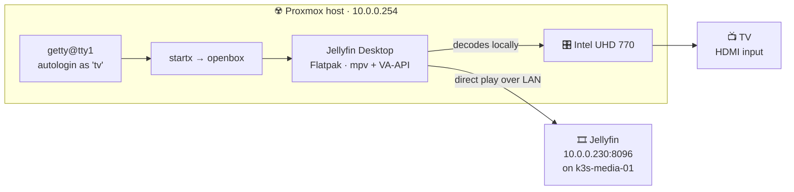

# Jellyfin on the living-room TV

The Proxmox host is wired to the TV by HDMI. This turns that cable into the product: the host
autologins on the physical console into a minimal graphical session running Jellyfin Desktop,
pointed at `http://10.0.0.230:8096`. Switch the TV to that input and Jellyfin is already on screen,
driven by the keyboard and mouse by the TV. No phone, no laptop, no accounts to set up on anyone's
device, and it comes back by itself after a power cut.



## Why this shape

The TV is a smart TV, but no Jellyfin client exists for it and none can be installed from its store.
The alternatives were weighed and rejected: a streaming stick costs money, the TV's browser is
unusable with a remote, and the DLNA plugin gives up the Jellyfin interface, resume points, and
reliable subtitles. A keyboard and mouse were already on hand, which is what makes this route
usable by the whole household rather than only by whoever has the Jellyfin phone app.

Two consequences are worth understanding before running the script.

**The iGPU is committed to the host.** `k3s-media-01` is a VM, so giving Jellyfin QSV transcoding
would need *exclusive* PCIe passthrough of the same iGPU this session draws with. The two cannot
coexist. In practice this costs little: the TV now decodes locally and direct-plays, so the server
is not asked to transcode for it at all. Transcoding stays on the CPU for remote clients over the
tailnet. See [First-run application wiring](configuration.md) for the transcoding note this
supersedes.

**The hypervisor gets software Proxmox does not ship.** X, PipeWire, and Flatpak are not part of
PVE. Flatpak keeps the player and its runtime out of `apt`, so a `pveupgrade` has nothing to
collide with, but this is still an unsupported configuration. Measured cost on this host: about
2 GB of the root filesystem — the same one holding the VM disks, which
[Proxmox one-time preparation](proxmox-prerequisites.md) asks you to keep 10-15 GB free on — and
roughly 1 GB of RAM, which on a 16 GB host is most of what was left.

**A note on the app's identity.** Flathub retired `com.github.iwalton3.jellyfin-media-player`;
the current client is Jellyfin Desktop, `org.jellyfin.JellyfinDesktop`. `flatpak install` quietly
falls back to a name search when an ID no longer resolves, so installing the dead ID appears to
succeed and only fails later, when the session launches an ID that is not there and the TV shows a
black screen. `tv-kiosk.sh --check` compares the ID in `.xinitrc` against the installed app for
exactly this reason.

## Install

`scripts/tv-kiosk.sh` runs on the Proxmox host, not from the laptop. It is idempotent: rerun it any
time to repair the session.

```powershell
scp scripts\tv-kiosk.sh root@10.0.0.254:/root/
ssh root@10.0.0.254 'bash /root/tv-kiosk.sh --check'
ssh root@10.0.0.254 'bash /root/tv-kiosk.sh'
```

It refuses to run if the iGPU is missing from the host or the root filesystem is short on space,
warns if Jellyfin is unreachable, then installs the packages, creates a locked `tv` user, installs
the player from Flathub, forces it fullscreen through openbox, writes the session files, and
enables autologin on `tty1`. The Intel VA-API driver arrives on its own: the KDE runtime declares
it `download-if=have-intel-gpu`, so flatpak pulls it in unasked on a host with an iGPU, and the
script verifies rather than installs it.

Audio is not part of this run — see [Audio](#audio) — because it needs the session to be live.

| What it changes | Where |
| --- | --- |
| X, openbox, PipeWire, Flatpak | `apt`, no recommends |
| Jellyfin Desktop + KDE runtime | system-wide Flatpak, about 2 GB |
| `tv` user, locked, no password | `video`, `render`, `input`, `audio` groups |
| Openbox rule forcing fullscreen, no decorations | `/home/tv/.config/openbox/rc.xml` |
| Session start and restart loop | `/home/tv/.xinitrc`, `/home/tv/.bash_profile` |
| Console autologin | `/etc/systemd/system/getty@tty1.service.d/autologin.conf` |

## First run

Restart the console and switch the TV to the host's HDMI input:

```bash
systemctl restart getty@tty1.service
```

Two one-time steps with the keyboard at the TV, after which nobody needs to touch settings again:

1. Point the player at `http://10.0.0.230:8096`.
2. Sign in and tick **remember me**, so a reboot does not land on a login screen.

Fullscreen needs no attention: openbox forces it from `rc.xml`, so the player fills the panel with
no title bar from the first frame.

Use a normal Jellyfin account here, not the admin one — this session is signed in permanently and
anyone in the house can reach it. [Charlotte's account](configuration.md) is the right model.

## Audio

Video works on the first try and audio does not, every time: the analog jack outranks HDMI on
profile priority, so the card comes up as *Built-in Audio Analog Stereo* and the TV is silent. This
cannot be fixed during the install, because it needs the kiosk session's own PipeWire to be
running. So it is a separate step, run once after the session is first up:

```bash
bash /root/tv-kiosk.sh --audio
```

That selects the `output:hdmi-stereo` card profile, makes the HDMI sink the default, and sets it to
100% — the TV's own remote is the volume control anyone will actually reach for. WirePlumber
persists the choice under `/home/tv/.local/state/wireplumber`, so it survives reboots and the step
does not need repeating. It is safe to rerun.

Stereo is deliberate. The TV advertises 5.1 and 7.1 over HDMI, but its own speakers are stereo, and
a surround profile on a set that cannot use it is a good way to end up with no sound at all. If a
receiver or soundbar ever sits in between, switch the profile to `output:hdmi-surround` by hand.

To inspect the state directly — note Proxmox ships no `sudo`, hence `runuser`, and `runuser` has no
shell to parse a leading `VAR=value`, hence `env`:

```bash
runuser -u tv -- env XDG_RUNTIME_DIR=/run/user/$(id -u tv) wpctl status
runuser -u tv -- env XDG_RUNTIME_DIR=/run/user/$(id -u tv) pactl list cards short
```

On this host that is card `alsa_card.pci-0000_00_1f.3`, sink
`alsa_output.pci-0000_00_1f.3.hdmi-stereo`.

## Everyday use

Turn the TV on, pick the input, use the arrow keys and Enter. That is the whole interface.

| Task | How |
| --- | --- |
| Restart the session | `systemctl restart getty@tty1.service` |
| Watch the session's own errors | `tail -f /home/tv/.xsession.log` |
| Xorg's log | `/home/tv/.local/share/xorg/Xorg.0.log` |
| Update the player | `flatpak update --system` |
| Confirm everything is still wired up | `bash /root/tv-kiosk.sh --check` |
| Repoint audio at HDMI after an audio change | `bash /root/tv-kiosk.sh --audio` |

The player should also register as a Jellyfin session, so it can be cast to and controlled from the
Jellyfin phone app when the keyboard is out of reach. That has not been verified on this host.

To see what is actually on the TV without walking to it, `scrot` is installed:

```bash
XAUTH=$(ls -t /tmp/serverauth.* | head -1)
DISPLAY=:0 XAUTHORITY=$XAUTH scrot -o /tmp/tv.png
```

## Display mode

The TV negotiates `3840x2160` at **30 Hz**, which is the ceiling this cable and port offer — the
mode list has no 4K60 in it. That is fine for films, which are 24p anyway, and the panel offers
`23.98` and `24.00` at 4K for judder-free playback. It does make menus feel less fluid than they
would at 60 Hz.

If the interface feels sluggish, `1920x1080` is available at 60 Hz and even 120 Hz, at the cost of
letting the TV upscale:

```bash
XAUTH=$(ls -t /tmp/serverauth.* | head -1)
DISPLAY=:0 XAUTHORITY=$XAUTH xrandr --output HDMI-1 --mode 1920x1080 --rate 60
```

To make a choice permanent, add the `xrandr` line to `/home/tv/.xinitrc` above the `openbox &` line
— but note that `tv-kiosk.sh` rewrites that file on every run, so the change belongs in the script
rather than on the host.

## Verifying it earns its keep

The point of decoding locally is that the server stops transcoding for the TV. Play something with
a codec that used to be expensive, then open **Jellyfin → Dashboard → Activity**: the session should
read **Direct Play**, not Transcode. If it says Transcode, the VA-API extension probably did not
install — `tv-kiosk.sh` warns when that happens, and rerunning it retries.

To watch the iGPU actually working, `apt-get install --no-install-recommends intel-gpu-tools` and
run `intel_gpu_top` while something plays; the Video engine should be busy.

## Troubleshooting

| Symptom | Likely cause |
| --- | --- |
| TV shows a text login prompt | Autologin drop-in missing or `getty@tty1` not restarted; rerun the script |
| Console logs in but stays black | X failed to start; read `/home/tv/.xsession.log` |
| Player opens in a small window | `~/.config/openbox/rc.xml` missing; rerun the script |
| TV shows a black screen with X running | `.xinitrc` launching a stale Flatpak ID; run `--check` |
| Picture but no sound | HDMI is not the default sink; run `tv-kiosk.sh --audio` |
| Stutter on high-bitrate files | VA-API extension missing; rerun the script and recheck Direct Play |
| Player asks for a server again | The signed-in session was lost; sign in and tick remember me |
| Everything broke after a PVE upgrade | Rerun `tv-kiosk.sh`; it repairs in place |

## Undoing it

```bash
bash /root/tv-kiosk.sh --uninstall
```

That removes the autologin, the player and its runtimes, and the `tv` user, leaving `tty1` an
ordinary login prompt. The X and audio packages are deliberately left installed — pulling them off
a running hypervisor is riskier than the disk they occupy — and the command to purge them anyway is
printed at the end.

## The upgrade path

If a native client ever becomes an option for this TV, take it. Both `jellyfin-tizen` (Samsung) and
`jellyfin-webos` (LG) exist and are good; they are simply not in the manufacturers' stores, so they
have to be sideloaded from the laptop, and each carries its own developer-mode upkeep — Samsung
certificates expire and stop the app launching, while LG's Dev Mode extender makes the session
effectively permanent. A native client would be operated by the TV remote instead of a keyboard on
the coffee table, and would hand the iGPU back for
[Jellyfin hardware transcoding](configuration.md). It is a clean swap: run `--uninstall` here first.
